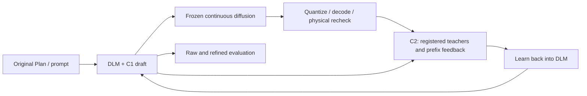

# CrystalDLM / DLM-ICLR

**Feedback learning for periodic diffusion language models in crystal generation.**

DLM-ICLR combines a material-condition Planner, a crystal-adapted LLaDA model, the C1 periodic relation layer, and frozen continuous refinement. The current C2 route organizes physically checked geometric teachers and supervision at real construction prefixes, then learns that experience back into the draft generator. C2 does not edit diffusion outputs in this route.

**中文主线：C1 在生成中建模周期坐标关系；C2 把连续精修和物理核验得到的完整教师、真实前缀监督学回 DLM；更新后的 DLM 再经固定 C1 生成新的 raw。** [完整方法、数学与教师故事](docs/C1_C2_METHOD_ZH.md) · [C2 简明说明](docs/C2_FEEDBACK_ZH.md) · [运行与材料契约](docs/registered-feedback.md)

This README describes branch **`codex/verified-feedback-train-20260920`**. The active entry is `python -m dlm_iclr.feedback`. The retained `dlm run` / `sample c2` path and older Chinese technical archive describe the historical post-F editor. Check out this branch for the registered-feedback implementation; do not infer that its code and current results are available on `main`.



## Method: periodic construction and physical feedback

**C1 provides a structured coordinate candidate distribution.** The DLM already conditions on previous commits. C1 additionally couples the current axis's candidate values, using logits and hidden states from the same forward pass, the sampled lattice and visible coordinates. With coordinate bins $z_i\in\mathbb Z_{100}$ and a fixed tree $T$:

$$
q_{\theta,\psi}^{(a)}(z\mid s)=
\frac{\mathbf1[z\text{ consistent with visible evidence}]}{Z(s)}
\exp\!\left[\frac{\sum_i\bar\ell_{\theta,i}(z_i;s)
+\sum_{(i,j)\in T}g_{\psi,ij}((z_i-z_j)\bmod100;s)}{\tau}\right].
$$

Here $\theta$ denotes the DLM's trainable LoRA parameters, $\psi$ the periodic head, and $\bar\ell$ merges periodic token aliases before temperature scaling. Bounded Fourier edge potentials express learned periodic compatibility. Tree inference is exact for the current fixed potentials and support, in $O(NQ^2)$; it is not exact joint inference over lattice and all XYZ. The constructor projects joint candidates through the registered confidence commit rule, reruns the DLM, and rebuilds the distribution. A candidate's joint probability is not the projected commit's probability. [C1 equations and execution](docs/modules/c1.md).

**C2 turns physical experience into learnable targets.** A teacher is produced by a workflow, not by an additional teacher LLM: frozen F and permitted relaxation propose geometry; exact-token physical checks assess it; registration and visible-prefix constraints turn it into supervision.

| Supervision | Preserved context | Target and verification |
|---|---|---|
| Complete geometric teacher | Original Plan/prompt; teacher lattice and relative periodic geometry | Same-element permutation and integer-bin global translation choose an equivalent token representation near the retained raw; decode and remeasure that exact representation |
| Actual-prefix correction | Original Plan/prompt, actual student lattice and **every visible coordinate** | Fill only missing coordinates using a registered teacher proposal; remeasure the whole completion, then supervise its values at the original commit positions |

Good continuous geometry does not automatically remain good after quantization. Likewise, a good complete teacher need not fit an arbitrary student prefix. These are two separate physical rechecks. The whole teacher learns compatible lattice/coordinate targets; the prefix teacher addresses states the student actually visited. Relative physical improvements can supply supervision without reaching SUN/MSUN.

For a verified prefix completion $B_v$ and the original raw $G_v$ that produced that prefix, the core gain and sampling weight are

$$
\Delta_v=u(B_v)-u(G_v)>0,\qquad w_v=\frac{\Delta_v}{1+\Delta_v}.
$$

$u$ is the fixed native force/stress/hull utility, not SUN. This gain belongs to the complete structure, not an isolated action's causal value. Sampling balances sources and axes, then uses $w_v$ **within** each prefix pool; it does not multiply the sampled loss by $w_v$ again.

The implemented feedback objective is

$$
\mathcal L_{\rm C2}(\theta)=
0.75\,\mathbb E_{\mathcal D_T}\ell(v;\theta)
+0.25\,\mathbb E_{\mathcal D_P^w}\ell(v;\theta),\qquad
\ell(v;\theta)=-\frac1{|A_v|}\sum_{j\in A_v}
\log\widetilde p_\theta(y_j^+\mid v).
$$

$\widetilde p$ is a typed-unary token reconstruction distribution; $A_v$ contains the supervised positions. Complete-teacher views cover lattice/X/Y/Z phases with future phases masked. Actual-prefix views retain the recorded input and supervise only the original commit positions. The recipe updates DLM LoRA, keeping C1, the backbone, trained vocabulary tables and F fixed. It uses no DPO, extra TRAIN replay or differentiation through F/CHGNet.

Learning changes both DLM logits and hidden states, so the next construction uses **$q_{\theta^+,\psi}$** even though C1 weights stay fixed. C2 therefore influences future construction through the learned generator. It is not an online physical-oracle call or a demonstrated learned online critic. [Full teacher, loss and probability definitions](docs/C1_C2_METHOD_ZH.md) · [Material contract and API](docs/registered-feedback.md).

## Evidence and current study

**Evidence scope:** the current result is a controlled study on 16 selected, seen TRAIN conditions with four fresh sampling streams. At the same body temperature 0.2, the unrelaxed CHGNet stability proxy increased from 7/64 to 35/64. It is not a claim about unseen MP-20 performance, DFT validation, learned online verifier gains, or shorter refinement. [Results and tradeoffs](docs/results/registered-feedback-train.md) include conventional SUN/MSUN, unknowns, and the F800 comparison.

As of this method update on **20 September 2026**, the expansion on H1A2 1,050 + R03 256 reporting requests has completed training: 1,244 complete teachers, 3,747 prefix views and 6,656 updates. Teacher NLL fell from 4.81624 to 3.70280 and fixed-prefix NLL from 5.53935 to 3.51846; coordinate top-1 remains 11.6%. These are fitting diagnostics.

**The completed expanded raw comparison does not reproduce the small-panel native gain:** the strict native proxy is 1/1,306 in each arm, with 39 unknowns in each arm. Conventional joint SUN is 33→34 and MSUN 178→159, with SUN unknowns 152→146; common-known SUN pairs have 15 gains and 15 losses. Mean native energy and force RMS worsen. F800/F400 results remain pending; evaluation and further research are to be paused for discussion after this documentation release. The [full raw report and diagnostic boundaries](docs/results/reporting-1306-raw.md) and [numeric snapshot](docs/results/reporting-1306-raw.json) preserve this result alongside the earlier limited evidence.

This comparison's starting model is the small-study **model25**, not the original paper B0. It uses the same 1,306 original requests, including failed Plans, with matched prompts, body/F seeds, body temperature 0.2 and fixed C1 rules. The requests are now **seen TRAIN data**. Joint-1,306 and 1,050/256 subpanels recompute uniqueness and full Direct metrics separately while sharing physical labels by structure key.

The fixed endpoints are **raw, F800 and F400**, reusing each model's same raw drafts; cross comparisons include student-F400 versus before-F800. F400 is a budget/schedule comparison: `time_start = diff_steps` means changing 800 to 400 changes the starting diffusion time as well as the step count. Report actual quality, unknowns and refinement time separately from physical-evaluation cost before claiming an efficiency gain. Independent DEV evidence is still required before the final 10,000-Plan main panel. [Evaluation and evidence boundaries](docs/C1_C2_METHOD_ZH.md#evidence).

## Quick start

Use Python 3.10–3.12 and install PyTorch/PyG for your CUDA version; see [installation](docs/installation.md).

```bash
python -m pip install -e '.[train,refine,physics,direct]'
dlm config --config configs/mp20.json --output configs/local.json
```

Set dataset and model locations in `configs/local.json`. Local directories and Hugging Face identifiers (`hf:owner/model`) are supported. Paths beginning with `@run/` refer to the configured output directory.

```bash
# Prepare all module datasets together
bash scripts/prepare.sh --config configs/local.json

# Train the base modules used by registered feedback
bash scripts/train.sh planner --config configs/local.json
bash scripts/train.sh b0 --config configs/local.json
bash scripts/train.sh c1 --config configs/local.json
bash scripts/train.sh diffusion --config configs/local.json

# Learn from reviewed, exact-token physical supervision artifacts
python -m dlm_iclr.feedback train \
  --config configs/local.json --assets outputs/initial_assets.json \
  --recipe configs/registered_feedback.json \
  --teachers outputs/material/teachers.jsonl \
  --prefix-feedback outputs/material/verified_prefix_supervision.jsonl \
  --material-review outputs/material/ROOT_REVIEW.json \
  --budget-ledger outputs/budget.json --budget-limits configs/feedback_budget.example.json \
  --output outputs/feedback_student

# Evaluate the frozen model on a Plan file fixed before outcomes are observed
python -m dlm_iclr.feedback evaluate \
  --config configs/local.json --assets outputs/feedback_student/assets.json \
  --recipe configs/registered_feedback.json --plans outputs/fixed_plans.jsonl \
  --budget-ledger outputs/budget.json --budget-limits configs/feedback_budget.example.json \
  --panel-scope seen_train --reference-split val --output outputs/feedback_evaluation
```

The material contract and preparation APIs are described in the [feedback guide](docs/registered-feedback.md); the commands do not invent missing physical labels. Set `MP_API_KEY` in the environment when uncached physical references are needed. On Windows, enable UTF-8 mode (`PYTHONUTF8=1`) for the third-party chemistry data files. The shared budget ledger must be reused across preparation, training, and evaluation.

| Module | Learns | Main artifact | Documentation |
|---|---|---|---|
| Planner | Seven-line material conditions with Llama 3 8B | Two-stage LoRA checkpoint | [Planner](docs/modules/planner.md) |
| B0 | Compact crystal vocabulary with masked denoising | LoRA and trained vocabulary tables | [B0](docs/modules/b0.md) |
| C1 | Periodic coordinate compatibility from DLM hidden states | Periodic probability head | [C1](docs/modules/c1.md) |
| Diffusion | Continuous lattice and coordinate denoising | CrysLLMGen diffusion model | [Diffusion](docs/modules/diffusion.md) |
| C2 feedback | Physically verified teachers and actual-prefix supervision | Reviewed material and updated draft adapter | [Feedback](docs/registered-feedback.md) |
| Evaluation | Geometry, stability, novelty and uniqueness | Per-structure and aggregate metrics | [Evaluation](docs/evaluation.md) |

## Change the dataset

CSV, structure JSONL and CIF directories use one adapter. Set split paths and field mappings; the adapter preserves atom blocks, polymorphs and supplied train/validation/test splits.

```bash
dlm config --config configs/custom.json --output configs/my-crystals.json
bash scripts/prepare.sh --config configs/my-crystals.json
# Pass planner, b0, c1 or diffusion; then use the feedback train entry above
bash scripts/train.sh c1 --config configs/my-crystals.json
```

The default vocabulary represents 1–20 atoms, atomic numbers 1–94, fractional coordinates at 0.01 resolution, lengths at 0.1 Å and angles at 1°. [Data interfaces](docs/data.md) describe source fields, prepared records and model assets.

## Retained baseline and legacy stages

The earlier post-F editor remains available for historical reproduction. It is not the registered-feedback method or the source of the new TRAIN result. The active feedback entry point is `python -m dlm_iclr.feedback`; older `dlm run` and `sample c2` commands below retain their legacy behavior.

```bash
bash scripts/train.sh c2 --stage warmup --config configs/local.json
bash scripts/sample.sh c1 --plans H1A2_1050 --config configs/local.json
bash scripts/sample.sh diffusion --config configs/local.json
bash scripts/query_hull.sh --config configs/local.json \
  --structures outputs/mp20/samples/refined.jsonl
bash scripts/evaluate.sh sun --config configs/local.json \
  --structures outputs/mp20/samples/refined.jsonl \
  --output outputs/mp20/samples/evaluation/refined
bash scripts/sample.sh c2 --config configs/local.json
bash scripts/evaluate.sh direct --config configs/local.json \
  --structures outputs/mp20/samples/edited.jsonl \
  --output outputs/mp20/samples/evaluation/direct
```

`dlm run` connects these stages. Use `--from-stage` and `--to-stage` for a segment. Numerical modules are also ordinary Python APIs.

## Configure compute

Independent requests run in separate workers. Feedback preparation reuses exact-structure physical caches, F can reuse fixed graph topology, and structural matching shares reference caches. The following `run.sh` example is the retained legacy interface; the active feedback entry uses the `runtime` fields in its feedback recipe.

```bash
bash scripts/run.sh --config configs/local.json --plans H1A2_1050 \
  --set 'runtime.devices=["cuda:0","cuda:1"]' \
  --set runtime.refine_workers_per_device=8 \
  --set runtime.physics_workers_per_device=8

torchrun --standalone --nproc_per_node=2 -m dlm_iclr train b0 \
  --config configs/local.json
```

B0 preserves effective batch 16 across single- and dual-process training. Checkpoints retain best and last states; completed stages can be reused with `--resume`. [Configuration](docs/configuration.md) lists settings and outputs.

## Reproducibility

The [SUN / MSUN / VUN result table](docs/results/C2_UNIFIED/RESULT_ZH.md) compares F800 and two C2 variants on the same 1,005 requests with jointly known labels from the historical 1,050-request panel. It includes Stable / MetaStable, validity, uniqueness, novelty, case studies and downloadable per-request records. These are physical-label-informed ablations; the report specifies the selection rules and denominator.

The historical `dlm run` defaults retain the earlier C1 and one-revision C2 editor, including its fitted risk penalty. The registered-feedback entry instead follows its explicit [feedback recipe](configs/registered_feedback.json). Saved Plan presets preserve source order and random seeds. The [reference profile](docs/reference.md) and [release validation](docs/validation.md) record initialization, checkpoint roles and optimization settings. Foundation and task checkpoints are supplied as local assets or produced by the training commands.

For the **current** C1/C2 story, mathematics and teacher pipeline, read [the complete Chinese method](docs/C1_C2_METHOD_ZH.md). The [older modular technical notes](private/README_ZH.md) and their [archived ZIP](private/technical_notes_zh.zip) retain the historical post-F editor and its original pipeline; they do not define the active registered-feedback recipe.

## Attribution

Continuous refinement follows [CrysLLMGen](https://github.com/kdmsit/crysllmgen), **NeurIPS 2025**, and its DiffCSP components. The language backbone is [LLaDA](https://github.com/ML-GSAI/LLaDA). C1 adapts the tractable structured-output idea studied by [CoDD](https://arxiv.org/abs/2603.00045). The retained legacy editor draws on remasking and reward-weighted proposal methods; those components are separate from the registered-teacher recipe evaluated here. See [references](docs/references.md) and [third-party notices](THIRD_PARTY_NOTICES.md).

Original project code uses the [MIT license](LICENSE). Model and dataset terms follow their providers.
