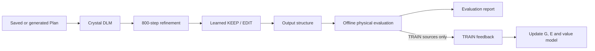

# DLM-ICLR

Crystal diffusion language models with continuous refinement and learned KEEP/EDIT.

The pipeline samples an exact-composition crystal with a diffusion language model (**G**), refines its continuous geometry with CrysLLMGen (**F**, 800 steps), and compares learned edit proposals against keeping that geometry (**E**). The editor uses the Plan, structures, its own model features and a forward-call budget. Physical evaluation supplies offline training targets and is performed after output selection.



## Install and configure

Use Python 3.10 or later and a CUDA installation compatible with your PyTorch build. The reference environment is recorded in [environment.md](docs/environment.md). Install matching PyTorch and PyG binary packages first, then:

```bash
python -m pip install -e '.[models,refiner,physics]'
dlm-iclr config --output configs/local.json
```

Fill in the model and evaluation asset paths in `configs/local.json`. The repository includes the trained 4.2 MB autonomous value head and the actual saved Plan presets. The large B0/editor/refiner checkpoints are external assets; see [assets.md](docs/assets.md) for their formats, provenance and availability. Evaluation additionally uses a CHGNet checkpoint, an official hull-reference cache, and the MP-20 training structures for novelty comparisons.

## Generate crystals

Use the real saved H1A2 Plan sequence:

```bash
bash scripts/run.sh infer --config configs/local.json \
  --plan-source H1A2_1200 --output outputs/h1a2
```

Choose the first 1050 legal Plans before generation, preserving their order and seeds:

```bash
bash scripts/run.sh infer --config configs/local.json \
  --plan-source H1A2_1200 --legal-only --requests 1050 \
  --gpus 1 --output outputs/h1a2-1050 --evaluate
```

`--plan-source R03_256` selects the actual R03 preset. A JSONL path supplies custom Plans. `--plan-source generate` invokes the configured H1 Llama Planner and saves its output before crystal generation. Without `--legal-only`, failed Planner entries remain in the request denominator. Failed crystal generation never triggers substitution of another Plan.

The same command runs inside a Slurm allocation:

```bash
sbatch --partition YOUR_PARTITION --gres=gpu:5 --cpus-per-task=20 \
  scripts/run.sbatch infer --config configs/local.json \
  --plan-source H1A2_1200 --legal-only --requests 1050 \
  --gpus 5 --output outputs/h1a2-1050 --evaluate
```

Output includes `structures.jsonl`, the selected Plan list, individual G/F/E records, candidate choices and actual forward counts. A repeated command resumes completed inference records in the same output directory when its inputs and settings match. [Usage](docs/usage.md) explains the Python interface, data preparation and execution options.

## Train and self-improve

Convert MP-20 or another CIF dataset, then exclude all evaluation compositions:

```bash
dlm-iclr prepare-data --source /data/mp20/train.csv \
  --dataset mp20 --split train --output outputs/data/train.jsonl
dlm-iclr prepare-train --source outputs/data/train.jsonl \
  --exclude outputs/evaluation-plans.jsonl --output outputs/data/clean-train.jsonl
```

The adapter accepts CSV with a `cif` column, JSONL with `cif` or `structure`, and directories of CIF files. MP-20 is the evaluated dataset; support for these common formats does not imply benchmark validation on other datasets. The retained representation supports 1–20 sites and atomic numbers up to 94 (Pu).

Run a complete sequence of fixed-Plan evaluation and three offline training rounds:

```bash
bash scripts/run.sh self-improve --config configs/local.json \
  --training-plans outputs/data/clean-train.jsonl --rounds 3 \
  --plan-source H1A2_1200 --legal-only --requests 1050 \
  --gpus 5 --output outputs/self-improvement
```

The command records S0 and S1–S3, trains only from the separate TRAIN sources, and completes the specified number of rounds. G uses conditional preferences, E uses real minibatch content and decision updates with consistent atom permutations, and the value model learns candidate-minus-current values. KL is a soft regularizer. [Method](docs/method.md) gives the objectives and retained defaults; [results](docs/results.md) separates completed component evidence from full-pipeline results.

For the included clean set of synthetic Planner-generated TRAIN conditions, use `--training-plans CLEAN_TRAIN_1000`. Missing physical references remain explicit unknowns with count bounds; they do not remove requests from evaluation.

For an individual update using previously compiled feedback:

```bash
bash scripts/train.sh E --config configs/local.json \
  --data outputs/self-improvement/round_1/train/feedback/E.jsonl \
  --output outputs/editor-update
```

## Code map

| Location | Responsibility |
|---|---|
| `src/dlm_iclr` | Public APIs, data adapters, pipeline, training and evaluation |
| `src/crystal_dlm` | Token representation, periodic geometry and model modules |
| `src/dlm_iclr/_vendor/crysllmgen` | Required CrysLLMGen numerical components |
| `scripts` | Thin shell and Slurm entry points using the same CLI |
| `tests` | Source selection, numerical invariants and model integration checks |
| `docs` | Method, environment, assets and results |

[Release validation](docs/validation.md) records model-output parity, checkpoint reloads, source invariants, and a complete small training loop.

## Attribution

This work builds on [LLaDA](https://github.com/ML-GSAI/LLaDA), [CrysLLMGen](https://github.com/kdmsit/crysllmgen), [DiffCSP](https://github.com/jiaor17/DiffCSP), [CHGNet](https://github.com/CederGroupHub/chgnet), and [pymatgen](https://github.com/materialsproject/pymatgen). See [THIRD_PARTY_NOTICES.md](THIRD_PARTY_NOTICES.md) for retained notices and source attribution. Original project code is distributed under the MIT license; external datasets and model assets retain their own terms.
