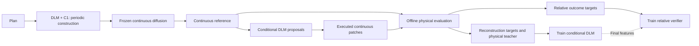

# CrystalDLM / DLM-ICLR

**Physical-feedback learning for periodic crystal generation.**

## Abstract

Crystal generation requires chemical composition, lattice geometry, and atomic coordinates to form a coherent periodic structure. Language–diffusion hybrids approach this task through discrete drafting followed by continuous refinement, but two challenges remain: capturing periodic dependencies as a draft is constructed, and converting physically evaluated outcomes into knowledge that can guide subsequent structural decisions.

We propose CrystalDLM, a diffusion language modeling framework that uses bidirectional masked prediction to connect periodic construction with physical-feedback learning. This conditional interface supports both completing an unfinished draft and reconstructing selected fields around a refined structure. During drafting, lattice-conditioned periodic interactions couple site-wise coordinate scores into a tractable joint distribution, allowing unresolved coordinate candidates to be proposed together. Frozen continuous diffusion then refines the draft, providing a geometric reference for learning which structural changes are physically worthwhile. A geometry-conditioned DLM proposes reconstructions around this reference while preserving continuous precision in unchanged fields. The reference and the resulting candidates undergo the same interatomic-potential relaxation and physical evaluation, making their outcomes directly comparable. These comparisons supply a reward-weighted teacher for masked reconstruction and relative supervision for a learned verifier: the conditional DLM is trained to propose physically preferred changes, and the verifier to decide when to adopt them.

On the retained MP-20 panel of 3,000 historically selected requests, the existing C2 configuration achieves confirmed SUN and MSUN rates of 9.87% and 49.00%, respectively, compared with 8.17% and 46.00% for F800. The resulting framework allows experience from continuous structural calculations to be reused through learned reconstruction and selection policies.

Results: [retained 3000-request panel and original protocol](docs/results/C2_HISTORY1000_TOP2_3000/RESULT_ZH.md).

**中文主线：C1 把周期关系放进候选分布；C2 把物理反馈放进条件学习。F 提供连续参照，物理核验形成教师，DLM 学习更可取的条件输出，验证模型学习怎样选择与保留。**

[完整故事、数学与教师机制](docs/PHYSICAL_FEEDBACK_MASTER_STORY_ZH.md) · [C1](docs/modules/c1.md) · [C2 物理反馈学习](docs/modules/c2.md) · [实现与复现](docs/keep-edit-implementation.md)

This is the retained method on **main**. The narrative explains its existing physical-feedback training; the main experiment's code, data, assets, execution and evaluation definitions remain unchanged.



## Method: geometry in the distribution, physical feedback in learning

**C1 models periodic compatibility during construction.** DLM logits and hidden states from the same forward pass define unary coordinate scores and lattice-conditioned edge potentials. A tractable tree distribution couples unresolved candidates:

$$
q_{\theta,\psi}(z\mid s)=\frac{\mathbf1[z\in\Omega_s]}{Z(s)}
\exp\!\left[\frac{\sum_i\ell_{\theta,i}(z_i;s)
+\sum_{(i,j)\in T}g_{\psi,ij}((z_i-z_j)\bmod Q;s)}{\tau}\right].
$$

Tree inference is exact for the current potentials and support, in $O(NQ^2)$. The constructor applies its actual commit rule, reruns the DLM and updates the distribution. This is a joint candidate distribution for the current axis, not exact joint inference over every lattice and XYZ field. [C1 mathematics and execution](docs/modules/c1.md).

**Frozen F supplies a continuous reference for learning.** It processes the draft's lattice and coordinates while retaining composition. Physical evaluation determines which executed alternatives are preferable; the diffusion model's denoising output is not itself a physical preference label. This makes continuous processing a source of structural context for feedback-trained conditional generation.

**C2 returns measured experience to a DLM conditional policy.** A geometry-conditioned DLM reopens selected fields using the reference and current proposal context. Continuous patching preserves unchanged numerical fields. Candidate outcomes become concrete field targets and relative decision targets, influencing future conditional outputs through parameter learning.

| Physical feedback | Learned behavior |
|---|---|
| Verified candidate geometry and action | Conditional content, scope and KEEP/EDIT supervision |
| Relative utility in a measured candidate pool | A finite-candidate teacher influencing DLM targets |
| Reference/candidate outcome differences | A learned relative value against KEEP |
| Invalid or non-converged outcomes under the fixed protocol | Geometric risk for a bounded conditional revision |

For retained candidate record $k$ with executed structure $C_k$ and reference $S$:

$$
q_T(k\mid S)=\frac{p_0(k)\exp([u(C_k)-u(S)]/\beta)}
{\sum_jp_0(j)\exp([u(C_j)-u(S)]/\beta)}.
$$

KEEP is included, and $p_0$ is uniform over retained candidate records. Original reconstruction/decision targets are mixed with teacher-sampled targets, using typed content supervision and reference KL. This is physical preference-guided conditional fitting. The finite-pool teacher is not a trajectory DPO objective.

The relative verifier uses the final conditional DLM's features, candidate tokens and action metadata to compare alternatives with KEEP. An eligible single-site proposal can undergo one bounded remasking step using completed context and predicted geometric risk. [Complete teacher, value and revision mathematics](docs/PHYSICAL_FEEDBACK_MASTER_STORY_ZH.md).

The learned inference core is **Plan → DLM+C1 → F reference → conditional proposals and relative verification → evaluation**. The conditional editor has its own task parameters; this training does not automatically update the initial B0+C1 draft generator. Runtime rules, exact configuration and result attribution are recorded in the [implementation and reproduction guide](docs/keep-edit-implementation.md).

## Quick start

Use Python 3.10–3.12 and install PyTorch/PyG for your CUDA version; see [installation](docs/installation.md).

```bash
python -m pip install -e '.[train,refine,physics,direct]'
dlm config --config configs/mp20.json --output configs/local.json
```

Set dataset and model locations in `configs/local.json`. Local paths and Hugging Face identifiers (`hf:owner/model`) are supported; `@run/` resolves below the configured output directory. Compatible existing assets can be reused.

```bash
bash scripts/prepare.sh --config configs/local.json
bash scripts/train.sh all --config configs/local.json
bash scripts/sample.sh planner --config configs/local.json
export MP_API_KEY='YOUR_MATERIALS_PROJECT_API_KEY'
bash scripts/run.sh --config configs/local.json \
  --plans outputs/mp20/samples/plans.jsonl
```

C2 training exposes `warmup`, `collect`, `label`, `compile`, `editor`, `light`, `value` and `risk`. Physical outcomes are collected before fitting feedback targets; value uses features from the final editor. See [C2](docs/modules/c2.md), [configuration](docs/configuration.md) and the [reference profile](docs/reference.md).

| Module | Learns or provides | Documentation |
|---|---|---|
| Planner | Material conditions | [Planner](docs/modules/planner.md) |
| B0 | Masked crystal-field prediction | [B0](docs/modules/b0.md) |
| C1 | Periodic compatibility between coordinate candidates | [C1](docs/modules/c1.md) |
| Frozen diffusion | Continuous lattice/coordinate references | [Diffusion](docs/modules/diffusion.md) |
| C2 | Physically supervised conditional reconstruction and relative verification | [C2](docs/modules/c2.md) |
| Evaluation | Structural outcomes and full-panel metrics | [Evaluation](docs/evaluation.md) |

## Data and compute

CSV, structure JSONL and CIF directories use one adapter, preserving atom blocks, polymorphs and supplied splits. The default vocabulary represents 1–20 atoms, atomic numbers 1–94, fractional coordinates at 0.01 resolution, lengths at 0.1 Å and angles at 1°. See [data interfaces](docs/data.md).

```bash
dlm config --config configs/custom.json --output configs/my-crystals.json
bash scripts/prepare.sh --config configs/my-crystals.json
bash scripts/train.sh c2 --config configs/my-crystals.json
```

Independent requests use saved random streams. Worker counts, C2 query batching and caches are configured separately. Reuse requires matching model, input and execution identities; physical labels additionally require the same structure and evaluation protocol. [Compute configuration](docs/configuration.md).

## Results and reproducibility

The [retained C2 table](docs/results/C2_UNIFIED/RESULT_ZH.md) reports F800 and C2 variants on the same 1,005 jointly known requests from the historical 1,050-request panel. Its selection rules, unknowns and denominator define the evidence. The [historical 3000](docs/results/C2_HISTORY1000_TOP2_3000/RESULT_ZH.md) and [5000](docs/results/C2_HISTORY1000_TOP4_5000/RESULT_ZH.md) reports preserve their selected-panel provenance.

Physical-label-informed result variants are described in those reports and the [reproduction guide](docs/keep-edit-implementation.md). They must not be relabeled as evidence for a different runtime configuration or for improvement of the initial raw draft.

The [Chinese technical notes](private/README_ZH.md) provide module-level training and mathematical details. The full narrative is the [physical-feedback Master Story](docs/PHYSICAL_FEEDBACK_MASTER_STORY_ZH.md); [release validation](docs/validation.md) records retained implementation checks.

## Attribution

Continuous refinement follows [CrysLLMGen](https://github.com/kdmsit/crysllmgen) and its DiffCSP components. The language backbone is [LLaDA](https://github.com/ML-GSAI/LLaDA). C1 adapts tractable structured-output ideas from [CoDD](https://arxiv.org/abs/2603.00045). C2 draws on remasking and reward-guided teacher ideas associated with [RemeDi](https://arxiv.org/abs/2509.23653) and [VIDD](https://arxiv.org/abs/2507.00445), with the actual crystal-specific objectives documented separately. See [references](docs/references.md) and [third-party notices](THIRD_PARTY_NOTICES.md).

Original project code uses the [MIT license](LICENSE). Model and dataset terms follow their providers.
