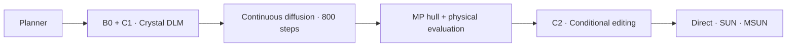

# DLM-ICLR

**Crystal generation with diffusion language models, periodic geometry and conditional refinement.**

DLM-ICLR provides a modular pipeline from material composition to evaluated crystal structures. A Llama planner proposes material conditions, a crystal-adapted LLaDA model constructs geometry through a learned periodic output distribution, and CrysLLMGen refines the continuous structure. A geometry-conditioned DLM editor then proposes local changes and performs one additional conditional revision.



The default workflow preserves F outputs already confirmed as stable, unique and novel. Other outputs enter C2, whose proposals are ranked with a learned relative value and a learned geometric risk score. Physical evaluation supplies the F-stage decision input and evaluates the final outputs.

## Quick start

Use Python 3.10–3.12 and install PyTorch/PyG for your CUDA version; see [installation](docs/installation.md).

```bash
python -m pip install -e '.[train,refine,physics,direct]'
dlm config --config configs/mp20.json --output configs/local.json
```

Set dataset and model locations in `configs/local.json`. Local directories and Hugging Face identifiers (`hf:owner/model`) are supported. Paths beginning with `@run/` refer to the configured output directory.

```bash
# Prepare all module datasets together
bash scripts/prepare.sh --config configs/local.json

# Train the complete stack, or pass one module name
bash scripts/train.sh all --config configs/local.json

# Generate material conditions
bash scripts/sample.sh planner --config configs/local.json

# Generation → refinement → editing → evaluation
export MP_API_KEY='YOUR_MATERIALS_PROJECT_API_KEY'
bash scripts/run.sh --config configs/local.json \
  --plans outputs/mp20/samples/plans.jsonl
```

| Module | Learns | Main artifact | Documentation |
|---|---|---|---|
| Planner | Seven-line material conditions with Llama 3 8B | Two-stage LoRA checkpoint | [Planner](docs/modules/planner.md) |
| B0 | Compact crystal vocabulary with masked denoising | LoRA and trained vocabulary tables | [B0](docs/modules/b0.md) |
| C1 | Periodic coordinate compatibility from DLM hidden states | Periodic probability head | [C1](docs/modules/c1.md) |
| Diffusion | Continuous lattice and coordinate denoising | CrysLLMGen diffusion model | [Diffusion](docs/modules/diffusion.md) |
| C2 | Geometric proposals, relative value and local revision | Editor, value and risk models | [C2](docs/modules/c2.md) |
| Evaluation | Geometry, stability, novelty and uniqueness | Per-structure and aggregate metrics | [Evaluation](docs/evaluation.md) |

## Change the dataset

CSV, structure JSONL and CIF directories use one adapter. Set split paths and field mappings; the adapter preserves atom blocks, polymorphs and supplied train/validation/test splits.

```bash
dlm config --config configs/custom.json --output configs/my-crystals.json
bash scripts/prepare.sh --config configs/my-crystals.json
bash scripts/train.sh all --config configs/my-crystals.json
```

The default vocabulary represents 1–20 atoms, atomic numbers 1–94, fractional coordinates at 0.01 resolution, lengths at 0.1 Å and angles at 1°. [Data interfaces](docs/data.md) describe source fields, prepared records and model assets.

## Run individual stages

```bash
bash scripts/train.sh c2 --stage warmup --config configs/local.json
bash scripts/sample.sh c1 --plans H1A2_1050 --config configs/local.json
bash scripts/sample.sh diffusion --config configs/local.json
bash scripts/query_hull.sh --config configs/local.json \
  --structures outputs/mp20/samples/refined.jsonl
bash scripts/evaluate.sh sun --config configs/local.json \
  --structures outputs/mp20/samples/refined.jsonl \
  --output outputs/mp20/samples/evaluation/refined
bash scripts/sample.sh c2 --config configs/local.json
bash scripts/evaluate.sh direct --config configs/local.json \
  --structures outputs/mp20/samples/edited.jsonl \
  --output outputs/mp20/samples/evaluation/direct
```

`dlm run` connects these stages. Use `--from-stage` and `--to-stage` for a segment. Numerical modules are also ordinary Python APIs.

## Configure compute

Independent requests run in separate workers. C2 batches model queries, F reuses fixed graph topology, and physics and structural matching share caches.

```bash
bash scripts/run.sh --config configs/local.json --plans H1A2_1050 \
  --set 'runtime.devices=["cuda:0","cuda:1"]' \
  --set runtime.refine_workers_per_device=8 \
  --set runtime.physics_workers_per_device=8

torchrun --standalone --nproc_per_node=2 -m dlm_iclr train b0 \
  --config configs/local.json
```

B0 preserves effective batch 16 across single- and dual-process training. Checkpoints retain best and last states; completed stages can be reused with `--resume`. [Configuration](docs/configuration.md) lists settings and outputs.

## Reproducibility

The [SUN / MSUN / VUN result table](docs/results/C2_UNIFIED/RESULT_ZH.md) compares F800 and two C2 variants on the same 1,005 requests with jointly known labels from the historical 1,050-request panel. It includes Stable / MetaStable, validity, uniqueness, novelty, case studies and downloadable per-request records. These are physical-label-informed ablations; the report specifies the selection rules and denominator.

Defaults follow the retained C1 and one-revision C2 execution, including the fitted risk penalty. Saved Plan presets preserve source order and random seeds. The [reference profile](docs/reference.md) and [release validation](docs/validation.md) record initialization, checkpoint roles and optimization settings. Foundation and task checkpoints are supplied as local assets or produced by the training commands.

Detailed Chinese notes cover each module's scientific task, training and inference, mathematical objectives, implementation and paper foundations: [read the technical notes](private/README_ZH.md) or [download the complete notes](private/technical_notes_zh.zip).

## Attribution

Continuous refinement follows [CrysLLMGen](https://github.com/kdmsit/crysllmgen), **NeurIPS 2025**, and its DiffCSP components. The language backbone is [LLaDA](https://github.com/ML-GSAI/LLaDA). C1 adapts the tractable structured-output idea studied by [CoDD](https://arxiv.org/abs/2603.00045); C2 draws on remasking from [RemeDi](https://arxiv.org/abs/2509.23653) and finite-support reward weighting motivated by [VIDD](https://arxiv.org/abs/2507.00445). See [references](docs/references.md) and [third-party notices](THIRD_PARTY_NOTICES.md).

Original project code uses the [MIT license](LICENSE). Model and dataset terms follow their providers.
