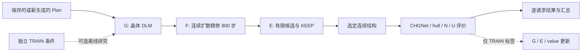

# 晶体 DLM、连续扩散精修与自主 KEEP/EDIT：方法和现有实验

本文对应当前公开实现，以及截至 2026-09-11 已保存的实验。主流程为 **Plan → G → F → E → 离线评价**。后续三组、每组三轮的自提升计划已因运行成本按用户要求取消；实际完成第一组的 S0 基线和一次更新后的 S1。本文报告完整保留这对结果，不把它写成三组实验、三轮提升或最佳种子结果。

这是一套可运行的生成与编辑框架。已有证据支持部分自主编辑和 MSUN 收益，但尚未建立稳定的 SUN 泛化提升。完整全流程首轮的已确认 SUN 为 112→107，MSUN 为 560→562；两者各有同一批 29 条未知请求。

KEEP/EDIT 是本文重点；另见 [KEEP/EDIT 专门说明](KEEP_EDIT_ZH.md)，按数据构造、训练与推理逐步展开，并用实际候选分数重放一次 KEEP 和一次 EDIT。

## 1. 系统要解决什么问题

晶体生成同时涉及离散组成、周期几何和物理稳定性。合法的元素计数不保证合理几何，合理几何也不保证低能量；局部编辑增加了候选，还需要判断其收益是否值得替换当前结构。

本实现把这几个问题分开处理：Plan 提供组成与材料上下文；离散扩散语言模型 G 构造晶体；预训练连续扩散模型 F 改善几何；编辑器 E 产生有限候选，由仅依赖模型与几何的价值网络比较候选和 KEEP。CHGNet、hull 参考和训练结构匹配在输出选定后提供评价，或在独立 TRAIN 数据上提供训练标签。



| 模块 | 输入 | 输出 | 是否读取当前实测物理结果 |
|---|---|---|---|
| Plan | 保存的条件，或 Planner 随机种子 | 组成、原子数、上下文、固定采样种子 | 否 |
| G | Plan、部分揭示的晶体 token | 晶格和分数坐标、生成轨迹 | 否 |
| F | G 的元素与连续几何、F 种子 | 精修结构、原始晶格矩阵、token 视图 | 否；F 是预训练生成模型 |
| E | Plan、current/proposal token 与几何、预算 | KEEP 或一个编辑端点 | 否 |
| value | E 的隐藏特征和 9 个几何量 | 预测 NS/NMS 值及相对 KEEP 增量 | 否 |
| 评价 | 已选定结构、固定物理与参考资产 | validity、能量、SUN/MSUN、未知原因 | 是，发生在选择之后 |

代码入口见 [模块对照](#11-复现入口资产与文件对应)。各模块不是端到端联合反向传播：F 和物理评价不参与 G/E 的梯度传播；自提升通过离线收集标签再更新模型。

## 2. 数据、Plan 和实验条件

### 2.1 Plan 的组成与上下文

硬组成字段包括 `N`、`elements`、`counts`，满足元素计数之和等于原子数。rich Plan 还包含 `anion_framework`、`charge_bucket`、`lattice_system`、`spacegroup_bucket`、`volume_per_atom_bin` 等上下文，以及组成派生的标识。

N 和元素多重集在 G/E 中固定。rich 字段主要作为语言条件；当前实现没有把全部空间群、晶系、体积桶变成必须成立的几何规则。因此，Plan 通过语法和计数检查不等于它的所有语义字段联合相容，也不等于输出实际具有所声明的空间群。

新 Plan 可由 H1A2 Llama Planner 生成：batch=1、temperature=0.9、top-p=0.95、top-k=50、最多 96 个新 token。解析失败的请求保留为失败记录。当前 1050 实验直接复用了已保存的 H1A2 条件，没有调用新的 Planner。

### 2.2 当前保存的数据集

| 数据 | 实际用途 | 数量与限制 |
|---|---|---|
| `H1A2_1200` | 保存的评估 Plan 池 | 1200 条，其中 1186 条合法 |
| `R03_256` | 另一组历史保存条件 | 256 条，其中 254 条合法；不能当成 H1A2 的同一组条件 |
| 当前评估 | 从 H1A2 原顺序取前 1050 条合法 Plan | 包括单原子请求；下游失败仍占分母 |
| `CLEAN_TRAIN_1000` | 当前离线更新的 TRAIN 条件 | 1000 条合成 Planner 条件，与评估组成不重叠 |
| MP-20 训练结构 | 新颖性参考、历史预训练来源 | 使用外部训练参考文件；不随本次生成结果重新选择 |

`CLEAN_TRAIN_1000` 的来源是合成条件，并非“从 MP-20 CSV 中取出的 1000 行”。数据转换器另外支持 CIF CSV、结构/CIF JSONL 和 CIF 目录，并保留来源、原始划分和行号。数据格式可适配不等于已经验证所有其他数据集上的性能。

TRAIN 排除规则按约分后的组成执行，并记录来源身份。1050 评估条件未用于本次自提升反馈；这不表示历史基础模型的预训练语料必然与评估组成完全不重叠。

### 2.3 S0、S1 与中止范围

S0 使用已准备好的 B0、minibatch E 和配套 value 初始检查点，运行完整 G/F/E。这里的“初始”是本次更新前，这些检查点此前已经训练过。

S1 使用第一轮独立 TRAIN 反馈更新后的 G/E/value。S0 和 S1 的 Plan 文件、原顺序及 G/F 种子完全相同；Plan 原始文件 SHA-256 相同，公开的结构与评分也逐条按 `source_id`、`ordinal` 绑定。种子使用非负 63 位整数，数据工具应使用可保持整数精度的 JSON 解析器。

原计划是三组独立随机流，每组 S0–S3。运行 1 保留原流，计划运行 2/3 分别重设采样种子 314159/271828；训练基种子计划为 20260911/20261911/20262911，每轮增加轮次编号。实际只完成运行 1 的首轮，训练种子为 20260912。第二轮的 TRAIN 生成已完成，但反馈中途取消，未形成第二次模型更新及 S2。运行 2/3 未启动。

[原登记协议](formal_protocol.json)作为历史计划保留；[实际执行状态](../data/experiments/completed_1050/experiment_status.json)明确记录取消范围。没有从不完整轨迹中实施原定的 best-of-three 选择。

## 3. 晶体表示：token 视图与连续几何

对 N 个原子的结构，动态序列长度为

\[
L=7+4N.
\]

排列为一个原子数 token、六个晶格参数 token，然后每个原子一个元素 token 和三个分数坐标 token：

```text
N | a b c alpha beta gamma | E1 x1 y1 z1 | ... | EN xN yN zN
```

| 类型 | 当前词表范围 | 几何解释 |
|---|---|---|
| 原子数 | 1–20 | 固定长度及组成约束 |
| 元素 | H–Pu，原子序数 1–94 | 元素身份；E 不改变计数和物种 |
| 长度 | 编码 bin 0–500，步长 0.1 Å | 编码可表达 0–50 Å；零/无效晶格仍由支持与检查拒绝 |
| 角度 | 1–179 | 单位为度 |
| 分数坐标 | bin 0–100，步长 0.01 | 周期为 1，000 与 100 表示同一位置 |

离散化会损失精度，因此 F 后同时保留连续结构和供 E 使用的 token 视图。最终提交编辑时只回写真正变化的数值字段；未变化字段保持原浮点值。不能把整份 current 重新量化后称作严格 KEEP，也不能给一个量化后的结构沿用原连续结构的物理标签。

这套 token 表示不自动实现任意晶格基变换、旋转、平移和原子排列的严格统一规范。代码针对周期别名、刚性平移和一致原子置换做了明确处理，但没有声称整个语言模型对所有晶体对称变换严格等变。

## 4. G：固定组成的扩散语言模型构造

### 4.1 模型和揭示顺序

G 加载晶体 B0 适配器及其扩展后的输入/输出表。普通 LLaDA 权重缺少已训练晶体 token 表，不能直接替代 B0。当前 G 的离线更新只训练 LoRA 参数，已有 IO 表保留并随检查点保存。

初始化时预填 N 和按 Plan 顺序展开的所有元素 token，其余数值位置为 mask。揭示顺序沿用 R03：先处理晶格，再按物种分组处理 X/Y/Z 坐标。在分组内部仍执行逐步揭示，保留未确定位置和对应可见上下文；它并非对普通文本做一次从左到右的生成。

对当前位置 i，可把实际受约束的采样分布写作

\[
q_\theta(v\mid P,b_{\mathrm{visible}})
=\frac{\exp(\tilde\ell_\theta(v)/T)\,\mathbf 1[v\in A_i]}
{\sum_{u\in A_i}\exp(\tilde\ell_\theta(u)/T)},\qquad T=0.7.
\]

这里 \(A_i\) 是该类型与当前几何上下文的允许集，\(\tilde\ell\) 包含周期别名合并等处理。随机流按请求绑定，批次与恢复过程有轨迹记录。`cfg_scale=0`；当前实现没有使用分类器自由引导放大条件。

### 4.2 几何支持与恢复

生成期间应用类型约束、重复周期坐标约束、晶格可构造性及可用上下文下的距离支持。000/100 的周期别名用 logaddexp 合并概率质量。R03 生成过滤使用半径 2 的 125 个周期像；它是具体有限支持实现，不应泛化为任意极斜晶格的全局几何保证。

失败恢复仍保持原 Plan：依次考虑重新打开失败位置、邻近位置和更大数值区域。晶格角度失败时可条件化已知 alpha/beta 后重采样 gamma。最后的 Z 续填可以放宽跨原子距离支持，但仍保留原有重复坐标保护。所有尝试、失败原因与实际 DLM 调用数都记录，不用另一个 Plan 替换失败请求。

恢复改善了可构造率，但无法保证所有输入可修复。例如此前请求 837 得到合法并收敛的结构后，F 后 hull 约 +0.1249 eV/atom，仍未达到 MS 门槛；请求 549 的额外诊断仍失败。549 的一次 163 调用诊断超出正常编辑预算，不作为合格推理成功例子。

## 5. F：连续扩散精修

F 使用预训练 CrysLLMGen `model_494.pt`，训练噪声日程为 1000 步，公开默认精修步数为 800。元素与原子数固定，更新晶格矩阵和分数坐标。该阶段的权重在当前 S0/S1 实验中冻结。

当前接口把 G 的坐标和晶格直接作为 \(x_T,L_T\)，从 `t=800` 向下执行上游 predictor/corrector 采样；没有额外先把 G 输出扩散到纯噪声。也没有声称任意 G 输出恰好来自该时间点的前向噪声分布。

以代码中已经乘过归一化因子的坐标预测量 \(d_x\) 表示，corrector 和 predictor 的形式为

\[
x_{t-1/2}=x_t-\eta_t d_x+\sqrt{2\eta_t}\,\xi,
\qquad \eta_t=10^{-5}(\sigma_t/\sigma_{\min})^2,
\]

\[
x_{t-1}=\left[x_{t-1/2}-(\sigma_t^2-\sigma_{t-1}^2)d'_x
+\sqrt{\sigma_{t-1}^2(\sigma_t^2-\sigma_{t-1}^2)/\sigma_t^2}\,\xi'\right]\bmod1,
\]

\[
L_{t-1}=\frac{1}{\sqrt{\alpha_t}}\left[L_t-
\frac{1-\alpha_t}{\sqrt{1-\bar\alpha_t}}d_L\right]+\tilde\sigma_t\xi_L.
\]

每一步在 corrector 和 predictor 各调用一次 decoder，800 步对应 1600 次 F decoder 前向。这些调用与 G/E 的 DLM 调用属于不同模型，不能混成一个“80 次调用”的预算。

F 每个请求保持 batch=1，并在创建 DataLoader 迭代器前设置 Python、NumPy、PyTorch 随机种子。并发通过独立 worker 进程实现；当前正式执行使用每张 GPU 8 个 F worker。已验证的匹配种子样例在该方式下保持逐值一致，但这项验证不是所有硬件、库版本和随机种子的普遍定理。

保存的原始晶格矩阵与最终结构使用的 lengths/angles 读出同时保留。发生无效 F 几何时记录回退来源。S0 有 1047 条正常连续 F 输出、2 条因 F 几何问题回到 G、1 条 G 生成失败；S1 的 1050 条均正常得到连续 F 输出。

## 6. E：周期状态条件与有限候选编辑

### 6.1 状态输入和网络结构

E 在 B0 上增加旧状态与当前状态条件模块、数值适配器和决策头。它同时看见原始 current token 和正在编辑的 proposal token，不把“未知坐标”当成真实零坐标。

周期状态模块使用元素、坐标已知标志、动作位置、周期环境等信息。默认内部宽度 128，16 个径向基函数，距离 cutoff=6 Å，周期像半径=2。周期环境对范围内各像的径向特征求和，并排除中心自配对；这与仅使用一次 minimum-image 距离是不同的特征定义。

数值适配器包括 27 维 cell 输入、21 维 site 输入和 4 维 task 输入。坐标使用 sin/cos 周期编码，并保留是否已知的标志。旧/新 cell、旧/新 site 和任务状态以残差形式注入 DLM 的数值位置；新增模块保持 FP32。

最终隐藏状态中，六个 cell 位置平均成 \(h_c\)，各元素位置的 site 隐藏状态平均成 \(h_s\)，拼成

\[
h=[h_c;h_s]\in\mathbb R^{8192}.
\]

动作范围头与数量头读取 h；位置头读取各 site 隐藏状态。另保留四输出 quality head；当前新 minibatch 决策监督使用其中第 4 个接受输出，最终选择由独立的自主 value 网络完成。

### 6.2 动作空间与候选生成

动作有四种：`none`、`local_xyz`、`all_xyz`、`full_cell`。局部位置数量候选为 1/2/4/8，受 N 限制；`full_cell` 同时打开晶格和全部坐标。元素与计数始终固定。

默认最多生成 8 个候选。首候选根据学习到的范围/数量/位置头选择非 KEEP 动作；如果范围头首先选择 none，则取它最偏好的非 KEEP 范围产生候选，显式 KEEP 留给最终价值比较。后续候选使用不同随机流，在学习到的位置排序上依次选择单 site。小 N 时位置可能重复，但随机流不同。N=1 的坐标平移本身不改变晶体，因而使用包含 cell 的候选。

每个候选依次经过 inspect、按允许 token 支持续填、几何检查和 judge。最终还要进行 value 特征前向。一个完整请求共享最多 80 次额外 DLM 调用，包含 KEEP 特征前向以及候选各阶段的实际前向；不是每个候选各有 80 次。完整提案放不进剩余预算就停止该候选，实际候选数可少于 8。

当前 1050 面板的实际 E 最大调用数为 73；S0 平均 48.961，S1 平均 49.023。单原子输入的完整 cell 候选较贵，只容纳 6 个。训练/开发阶段“最多 49 次”的组件面板统计不能套用成包含单原子输入的全流程统一上限。

### 6.3 连续结构提交

候选首先绑定到唯一 current。提交时检查原子身份与排列，只把变化 token 对应的数值写回连续结构；未改的 cell/坐标保留原始精度。周期等价变化、整体刚性平移、无效补丁和没有实际变化的提案返回 KEEP。

这个规则把“编辑一个局部位置”与“量化整份 current”区分开，使得 KEEP 对照真正代表原输入。评价的几何身份由 `record_key` 绑定。连续端点与完整 token 解码端点若不同，需要分别测量。

## 7. 自主 value 与 KEEP 比较

### 7.1 输入和预测量

value 的输入是上述 8192 维 h，以及 9 个由 current/已提交 proposal 计算的几何量：

1. N/20；
2. 被编辑 site 的比例；
3. 动作数值 token 数占 \(6+3N\) 的比例；
4. 是否修改 cell；
5. 周期居中分数坐标位移 RMS；
6. 周期居中分数坐标最大位移；
7. 以 current 晶格计算的 Cartesian 位移 RMS/10；
8. 同定义的最大位移/10；
9. 几何差是否可取得。

Cartesian 位移描述使用 current 晶格，不是对晶格变化后所有物理位移的完整描述。模型特征视图固定 `task=1`、`remaining=80`、`reveal=1`；实际调用预算独立计数。

网络为

\[
z=[\operatorname{SiLU}(W_hh+b_h);g]\in\mathbb R^{137},\qquad
v=W_o\frac{z-\mu}{s}+b_o\in\mathbb R^2,
\]

其中 \(W_h\) 将 8192 维映射到 128 维。归一化使用 TRAIN 的来源均衡统计，标准差下限为 0.05。两维监督目标分别是 **novel AND stable（NS）**、**novel AND metastable（NMS）**。这里不直接学习依赖整批顺序的 U，因此预测 NS/NMS 与最终 SUN/MSUN 是不同量。

### 7.2 精确零增量 KEEP

对候选 p 与 current c，比较

\[
\Delta v(p)=v(P,c,p,a)-v(P,c,c,\varnothing),\qquad
u(p)=2\Delta v_{NS}+\Delta v_{NMS}.
\]

KEEP 的增量精确为零。按 utility、NS 增量、优先 KEEP、候选原顺序依次打破平局。只有候选的排序键超过 KEEP 才提交。

输出为回归分数，没有 sigmoid，也不保证是校准概率。当前实测稳定性、hull、力、应力、N/U 标签或教师预测均不进入这个接口。训练时的物理反馈会影响权重，但推理时不现场读取这些结果。E 的旧接受概率只作为诊断保存。

## 8. 可选离线更新：数据、目标与真实训练量

此部分描述保留代码及已经执行的研究流程；用户已停止后续自提升。它不是已经证实会反复提高 SUN 的默认保证。

### 8.1 TRAIN 反馈构建

每轮在独立 TRAIN 条件上跑 G/F/E，然后对 G、current F 和候选端点做物理评价。相同几何按内容缓存复用；物理标签绑定到确切结构。

可信的端点质量先按“新颖且严格稳定、严格稳定、亚稳、其他”分层，再按 hull 排序。同层进一步改善采用实现中的 0.01 eV/atom 门槛；最高新颖稳定层不会只因微小能量改善再形成正例。明确生成/几何失败可作为零质量失败目标；缺参考、未通过所需可靠性检查等情况不能冒充稳定性已知。具体规则保留于 `endpoint_targets`、`quality`、`improves`。

E 每个来源最多构建一个 actor 行：有可信有用提案时使用相应动作与内容监督，否则用该已测候选池支持的拒绝/KEEP 标签。拒绝只说明当前候选池，没有证明不存在其他有用编辑。value 使用所有可用的已提交候选比较，因此一个来源可有多行，训练按来源均衡。

G 的 teacher 候选可来自连续 F/E，但最终全 token teacher 必须重新解码并独立测量。不会把连续 F 的标签直接赋给量化后几何不同的 teacher。当前首轮 1000 个 TRAIN 条件最终产生 G 730 行、E 972 行、value 7766 行；差异来自监督资格筛选，评估分母仍固定为 1050。

### 8.2 G 的条件偏好目标

每个来源随机选择两个数值 cut，chosen/rejected 使用匹配的 cut/seed。实现中的 \(\ell_\theta\) 是该 cut 下**下一个数值 token 的受约束条件 log-probability**，并非计算整份晶体的精确联合似然。

偏好项为

\[
\mathcal L_G=-\log\sigma\{\beta[(\ell_\theta^+-\ell_{ref}^+)-(\ell_\theta^--\ell_{ref}^-)]\}
-w_a\ell_\theta^+ +\lambda D_{KL}(q_{ref}\Vert q_\theta).
\]

健康 anchor 行只使用对应的 anchor 拟合项；批次按来源数和 mask cuts 归一化。默认 \(\beta=0.1,w_a=0.2,\lambda=1\)，采样温度 0.7，4 epochs、batch 32、LoRA LR=5e-6。参考参数在该次更新开始时冻结，KL 是软正则。

### 8.3 E 的内容和决策目标

E 对正内容目标的动作数值位置计算 dense typed-token CE，并加参考方向 \(KL(q_{ref}\Vert q_\theta)\)。一个来源按其动作位置平均后贡献一次，避免打开更多 token 的样本仅因长度占更大权重。

决策监督包含范围 CE、局部 site 的 categorical 交叉熵、局部数量 CE，以及接受输出的 BCE。已知 SUN 的 TRAIN 行对范围/接受项给予 2 倍权重；该标志用于离线损失，不注入自主选择接口。决策损失从内容隐藏特征 detach，内容学习主要由 CE/KL 提供梯度。

每个 minibatch 真正执行一次优化器更新。默认 8 epochs、batch 16，内容 LR=2e-6、决策头 LR=1e-4，KL 权重 1。原子块置换同步作用于 current、proposal、teacher 和位置标签；不是只打乱文本而保留旧 site 标号。KL 不触发硬停止。

### 8.4 value 的离线教师与学生

学生的 8192→128 投影从 E 的 quality head 第一层初始化，再联合训练投影与 137→2 输出层。E 特征先固定抽取，value 拟合期间不反向更新 E。

离线教师可额外使用 12 个 current 物理/可靠性特征，包括当前稳定层级、新颖性是否已知及其值、验证/失败/不收敛状态、hull 是否已知、变换后的 hull 和原始力/应力等。教师使用嵌套 sigmoid，使严格目标概率不超过亚稳目标概率；这些额外特征和教师都只用于 TRAIN。

学生目标是 50% 实测 after 标签与 50% 教师 after 预测的混合，再减去真实 before 目标。损失包括 gain MSE、权重 0.1 的前后水平 MSE、来源内 NS 排序损失（权重 0.2）和输出权重 ridge（0.1）。来源内 KEEP 作为零增量比较对象。默认 64 epochs、每批 32 个来源，输出层 LR=1e-3、隐藏层 LR=1e-5、无 weight decay、梯度裁剪 1。

由于 E 更新会改变特征空间，更新 E 后需重新拟合配套 value；不能任意混用不同轮的 E 和 value。当前包内 4.2 MB value 对应组件研究选择的初始 E，不自动代表 S1 的 value。

### 8.5 首轮实际记录

| 模块 | 来源数 | 行数 | 实际优化器步数 | 有变化的参数张量数 | 训练循环计时 |
|---|---:|---:|---:|---:|---:|
| G | 730 | 730 | 92 | 320 | 2014.94 秒 |
| E | 972 | 972 | 488 | 386 | 1236.58 秒 |
| value | 972 | 7766 | 1984 | 4 | 58.74 秒 |

G 的每个来源访问 4 遍，E 的来源访问 8 遍；value 每行访问 64 遍。G/E 在不同 GPU 上并发，所以不能把两者计时直接相加为墙钟时间。value 的 58.74 秒是拟合循环，不含前面的 E 特征抽取和教师准备。完整参数变化、配置、训练曲线与 exposure 文件见 [训练数据目录](../data/experiments/completed_1050/training/)。

进一步区分 E 的监督：972 行中只有 445 行有正内容目标，其余 527 行监督 KEEP/拒绝；445 个内容来源和 972 个决策来源各实际使用 8 遍。本轮正动作全部是局部 XYZ，不能据架构支持四种范围就宣称获得了完整动作范围监督。真实标签与决策过程见 [KEEP/EDIT 重点文档](KEEP_EDIT_ZH.md)。

## 9. 评价定义与未知值

### 9.1 Direct

完整 Direct 保留 CrysLLMGen 的七项生成指标：`comp_valid`、`struct_valid`、`valid`、`wdist_density`、`wdist_num_elems`、`cov_recall`、`cov_precision`。

组成有效性使用 SMACT 的电荷/Pauling 检查，并保留单元素、全金属合金的上游规则。结构有效性沿用 0.5 Å 周期原子间距离及 0.1 ų 体积检查。完整模式的 `valid` 还依赖指纹可取得，因此不应在指纹失败时把它简单等同于两个 validity 的乘积。

密度和元素种类数使用 Wasserstein-1 距离。组成指纹为 Magpie 特征和冻结标准化参数；结构指纹为各 site CrystalNN `ops` 的平均。MP-20 coverage 的阈值分别是结构 0.4、组成 10.0。两种最近距离分别取最小值，最近邻可以不是同一个结构；precision 的分母是全部请求，而非仅成功指纹数。

`--metrics comp_struct` 只计算 `comp_valid` 和 `struct_valid`，实际跳过参考读取、指纹、分布距离及 coverage。此次数据整理没有重跑完整 Direct，所以 S0/S1 表中只报告原评估已保存的两项 validity；没有补造未计算的 Wasserstein/COV 数字。完整定义与命令见 [评价说明](evaluation.md)。

### 9.2 稳定性、N、U 与 SUN/MSUN

物理评价使用 CHGNet 0.3.0 权重和 0.4.2 包，FIRE、完整 cell 的 FrechetCellFilter、零外压、最多 1000 步；原子最大力 0.1 eV/Å 和最大应力 0.5 GPa 联合决定收敛。终态还在原表示、周期 wrap 和刚性分数平移表示下做能量一致性检查，容差 0.001 eV/atom。

参考 hull 为固定的官方 GGA/GGA+U 条目集。条目输入能量为总能量；评价比较同组成的每原子 hull 能量：

\[
e_h=E_{terminal}/N-E_{hull}(composition),\quad
S=\mathbf1[e_h\leq0],\quad MS=\mathbf1[e_h\leq0.1].
\]

这里式中 \(E_{terminal}\) 表示总终态能量；保存字段 `terminal_energy_eV_atom` 已经除过 N，使用保存字段时不要再次除 N。

N/U 匹配使用**CHGNet 弛豫之前的选定输出**，参数为 `StructureMatcher(ltol=0.2, stol=0.3, angle_tol=5)`。N 比较同 formula 的 MP-20 训练结构；U 按原请求顺序，将当前结构与所有更早的同 formula 输出比较。更早结构即使不稳定或不新颖也仍是唯一性见证，不采用传递聚类。

\[
SUN=S\land N\land U,\qquad MSUN=MS\land N\land U.
\]

MSUN 包含 SUN。另存 `verified_strict_sun`/`verified_meta_sun`，额外要求终态验证。主计数使用保存的终态能量定义，不能把主计数和验证子集混用。Direct validity 不被额外插入上述既有 SUN 谓词。

### 9.3 缺失参考及分母

当前固定参考有 Yb 覆盖缺口，涉及 30 个评估条件与 28 个 TRAIN 条件。缺参考的体系保持未知，不用另一泛函的能量、任意零值或删除请求补齐。

对每项谓词保存 confirmed、unknown 和 `[confirmed, confirmed+unknown]`。只要还有未知，该项完整点计数/点百分比为 `null`。合取中的一个已知 false 足以令 SUN 为 false，所以稳定性未知数和 SUN 未知数可以不同。区间是缺失标签导致的计数边界，**不是统计置信区间**。

## 10. 现有实验结果与成本

### 10.1 完整保留的 1050 请求 S0/S1

| 指标 | S0 已确认 | S0 未知 | S1 已确认 | S1 未知 |
|---|---:|---:|---:|---:|
| 可重建 | 1049 | 0 | 1050 | 0 |
| comp_valid | 923 | 0 | 924 | 0 |
| struct_valid | 1048 | 0 | 1050 | 0 |
| Stable | 120 | 30 | 119 | 29 |
| MS | 618 | 30 | 616 | 29 |
| SUN | 112 | 29 | 107 | 29 |
| MSUN | 560 | 29 | 562 | 29 |
| 终态验证通过 | 1038 | 0 | 1034 | 0 |

两项 validity 的比例分别为：组成 87.90%→88.00%，结构 99.81%→100%。SUN 的计数边界为 `[112,141]`→`[107,136]`，MSUN 为 `[560,589]`→`[562,591]`。

| 配对指标 | 两端均已知 | 获得 | 损失 | 净变化 |
|---|---:|---:|---:|---:|
| Stable | 1020 | 26 | 27 | −1 |
| MS | 1020 | 102 | 104 | −2 |
| SUN | 1021 | 27 | 32 | −5 |
| MSUN | 1021 | 124 | 122 | +2 |

S0 的实际 EDIT 数为 495，S1 为 669。动作增加没有带来 SUN 净增。由于 G、E、value 同时更新，这对结果不能把变化单独归因于某一个模块；它也不构成重复自提升有效或无效的多种子结论。

全部 [2100 行评分 CSV](../data/experiments/completed_1050/per_request_scores.csv)、[1050 行配对表](../data/experiments/completed_1050/paired_requests.csv)、[调用记录](../data/experiments/completed_1050/runtime.csv)、压缩结构/评分 JSONL、模型内容哈希和训练记录均已公开。数据保留失败与未知，没有仅公开成功子集。

### 10.2 组件研究

| 组件面板 | 请求数 | SUN 相对 KEEP | MSUN 相对 KEEP | Stable 相对 KEEP | 证据性质 |
|---|---:|---:|---:|---:|---|
| DEV | 247 | +2 | +8 | +1 | 已参与模型选择 |
| 原名 FINAL 的第二开发面板 | 246 | +1 | +6 | 0 | 已查看并参与探索，不能继续称盲测 |
| 新组成面板 | 96 | 0 | +5 | 0 | 冻结后未再据结果调参；有 F 输入与参考可用性筛选 |

96 条结果为 SUN 6→6、MSUN 49→54、Stable 6→6，40 次 EDIT。其中 Pd2Er2 的 hull 从 +0.001014 降到 −0.000433 eV/atom，约 1.45 meV/atom 的阈值附近跨越；GeTe2 则从 −0.087975 升到 +0.311785，损失原 SUN。这个结果支持存在有用编辑，但不能据一个接近阈值的样本宣称发现新稳定相，也不能推断任意新 Plan 的无条件成功率。

该组件 E 有 492 个来源、248 次真实 minibatch 更新；对应 value 使用 3930 行、64 遍、1024 步。它们与 1050 实验首轮的 972 来源/488 步及 7766 行/1984 步属于不同训练阶段。完整选择、面板、得失和诊断见 [组件记录](../data/experiments/components/autonomous_keep_edit.json)。混合包含 TRAIN 的整池结果只作为开发记录，不提升为独立主表。

### 10.3 成本

| 环节 | S0 | S1 |
|---|---:|---:|
| 1050 条 G | 36.08 分钟 | 32.21 分钟 |
| 1050 条 F | 33.05 分钟 | 32.95 分钟 |
| 1050 条 E | 8.96 分钟 | 8.96 分钟 |

上述是 5 张 A800 上保存的阶段墙钟时间，不含后续评价。首轮 1000 条 TRAIN 的 G/F/E 合计约 69.43 分钟；近一万个候选端点的物理打标签约 108 分钟，之后还包括独立全 token teacher 评价、训练、特征抽取和 S1 再评价。

取消时作业总时长 8 小时 47 分 42 秒，已进入第二轮。该总时长包含第一轮、基线及第二轮已做的部分工作，不能全部归到某一个模型训练循环。记录支撑“成本高且首轮没有明确收益”的实际决策；没有给未运行的后续轮次估造时间或结果。

## 11. 复现入口、资产与文件对应

较早的 clean-1000、固定 G/F 的 T2T、接受规则与实测 current 辅助排序记录另存于 [development 数据](../data/experiments/development/index.json)。早期 clean-1000 是 TRAIN 面板，且含 known-SUN 分流/保护；部分较大排序收益也使用 current 物理状态。它们不与当前自主 1050 结果混表，历史记录中的“运行中”或后续计划文字也不代表现在仍在运行。

### 11.1 读取已完成的数据

```bash
python scripts/verify_experiment_data.py
```

该命令只核验文件哈希、原请求顺序、结构绑定、计数/未知边界及配对得失，不运行模型或物理评价。公开数据说明见 [数据索引](../data/experiments/README.md)。`manifest.json` 是公开文件的哈希目录；原始来源哈希另存，经过基础设施路径清理的元数据不冒称与原文件逐字节相同。

### 11.2 推理与独立评价

```bash
dlm-iclr config --output configs/local.json
# 在 local.json 中填写自己持有的模型与参考资产
dlm-iclr infer --config configs/local.json --plan-source H1A2_1200 \
  --legal-only --requests 1050 --gpus 5 --output outputs/sample

dlm-iclr evaluate-direct --run outputs/sample --metrics comp_struct
dlm-iclr evaluate-direct --run outputs/sample --reference /data/mp20/test.csv --workers 8
dlm-iclr evaluate-sun --config configs/local.json --run outputs/sample --gpus 5
```

运行本报告对应流程需要 B0、E、F、CHGNet、固定 hull 缓存与 MP-20 novelty 参考。仓库仅包含小型 value、Plan、代码和本文数据，大型模型仍是外部资产；没有声称克隆仓库就已获得全部权重。S1 权重的内容身份已记录，但未把数 GB 的 G/E 权重装入 Git。

新 Plan 还需 H1A2 Planner 与其基础模型；复用保存条件不需要重新加载 Planner。软件版本见 [环境说明](environment.md)，资产格式及参考能量单位见 [资产说明](assets.md)。本次整理没有重新启动已经取消的实验。

| 文件 | 对应职责 |
|---|---|
| `src/dlm_iclr/plans.py`, `planner.py`, `datasets.py` | 条件、来源排除、Planner 与数据适配 |
| `src/dlm_iclr/generation.py` | G 固定组成与揭示流程 |
| `src/crystal_dlm/construction_recovery.py` | 同 Plan 失败恢复 |
| `src/dlm_iclr/refinement.py` | F 随机流、连续输出与 token 视图 |
| `src/crystal_dlm/expert_edit.py`, `periodic_state_conditioning.py` | E 状态网络与决策头 |
| `src/dlm_iclr/proposals.py`, `editing.py`, `value.py` | 候选、连续补丁、增量 KEEP/EDIT |
| `src/dlm_iclr/feedback.py`, `training.py`, `value_training.py` | TRAIN 目标、G/E 更新、离线蒸馏 |
| `src/dlm_iclr/direct.py`, `direct_features.py` | 完整/快速 Direct |
| `src/dlm_iclr/physics.py`, `evaluation.py` | 离线物理与 SUN/MSUN |
| `src/crystal_dlm/exact_sun_nu.py` | 有方向、保留原顺序的 N/U 谓词 |

实现与预训练组件来自 LLaDA、CrysLLMGen、DiffCSP、pymatgen、CHGNet、SMACT、matminer 等工作；许可和来源见 [第三方说明](../THIRD_PARTY_NOTICES.md)。工程验证见 [validation](validation.md)。此前发布的模型调用一致性、保存重载、小规模完整训练链验证，与这里的物理质量结论分别报告。

## 12. 方法演进：保留了什么，哪些尝试没有成立

下面按历史阶段概括。旧分支有不同初始化、条件和评价口径，不能串成一个累计训练轮数。完整的 **57 条历史结果**与 **15 份来源记录**见 [历史数据](../data/experiments/historical/ledger.json)及 [历史表格](../data/experiments/historical/results.csv)；每行保留 comparison group、endpoint、分母和来源指针。

| 阶段 | 主要尝试 | 已观察到的结果与保留决定 |
|---|---|---|
| H1A2 / R5-C 起点 | rich 文本 Plan、exact-length 晶体 token、连续精修 | 形成当前固定组成及 7+4N 路线的基础。历史“前 1000 个成功者”和全部 1200 请求分母不同；旧数字不直接作为当前 1050 基线。 |
| 组成与条件建模 | C3FD typed 化学解码、Llama 融合、不同 soft/pointer 条件 | 改善组成生成/表示的工程可行性，但合法组成不保证低 hull。若干分支从原始模型重新初始化，不能视作连续继承 H1A2/B0 的训练。 |
| Grounding、更多 CE、SGTC | 条件拟合、额外训练、稳定结构 teacher 子集 | 对应固定 1000 面板中未见一致 SUN 提升；例如 grounding 的同组 Strict/Meta 89/487→86/467。保留结果，不因训练量增加就采用。 |
| 轴向与联合揭示、精修步数 | 比较 axis/joint 与不同 F 步数 | L6 同组 512 汇总里 full-axis 的 tau800 为 48/230，full-joint 为 29/146；full-axis tau200/500 为 29/171、39/222。支持保留已验证的轴向接口与 800 步配方，但不证明其在所有数据上最优。 |
| 周期状态路径 K4/K8 | 用已验证路径更新状态条件与动作生成 | 开发 256 面板的 raw 与 F 后结论不同；例如 K8 raw 11/66，F 后 17/123。没有把 raw 改善自动解释成完整链的 SUN 改善。 |
| 独立 periodic DLM V1/V2 与 mixed V3 | 新 token/周期状态训练、几何注意力或连续几何头 | V1/V2 的重新初始化与 V3 对 V2 的继承分别记账；几何头可运行不等于最后物理指标占优。多数候选未替换保留路线。 |
| 接触、混合、cooperative 等变体 | 短接触处理、等权混合、构造/闭合端点组合 | 存在个别局部改善，但同组最终结果不支持稳定整体优势。历史不可绑定到单一 measured-1000 的 105/488 汇总未作为正式结果采用。 |
| 连续几何和评价一致性审计 | 检查原矩阵读出、量化、随机流、终态能量与 N/U | 保留原始矩阵、连续 current、精确 patch 和结构绑定；把参考缺口、未收敛及匹配未知显式记录。这些修正提高可解释性，不能单独计为模型质量提升。 |
| 旧 E3 与 T2T/接受规则试验 | 固定 G/F，比较仅头训练、内容 LR、KL 硬停和阈值 | 153/51/52 来源划分的试验中获选策略全部 KEEP，FINAL 没有 Stable 晋升，未通过采用条件。CE/KL 改善未自动转化为物理改善。 |
| 较早的 clean-1000 流程 | 在单独的 1000 TRAIN 面板上运行 S0/S1，保留旧 known-SUN 分流与 token 回写 | 这是旧反馈流程的训练面板与诊断，已停止；不能作为当前自主推理的独立测试。初始化、S0/S1、权重更新和停止回执均另行归档。 |
| 真实 minibatch 与一致置换 | 修正内容优化器更新粒度、soft KL、原子块/标签同步 | E 实际完成 248 次更新、492 来源各 8 遍，位置选择的 site0 集中现象减少。它证明参数与行为改变，物理收益仍单独验证。 |
| 绝对接受分数与增量比较 | 将候选值减去同视图 current 值，KEEP 固定零 | 避免把 KEEP 的绝对拟合误差变成接受阈值。较早依赖实测 current 状态的较大收益重新归为离线辅助比较，未放进自主主表。 |
| 自主价值蒸馏与八候选 | 仅模型/几何输入，训练期使用物理教师 | 96 个新组成获得 MSUN +5、SUN 净 0；Pd2Er2 获得和 GeTe2 损失均保留。组件可行，但没有建立可靠的 SUN 泛化收益。837 可构造但不够稳定，549 仍未修复。 |
| 可复用代码发布 | 独立资产接口、数据适配、严格连续 KEEP、评估入口 | 完成调用一致性、检查点重载及小规模闭环验证。完整 Direct 与快速 validity 通过七项旧版公式对照；28 项代码测试通过。 |
| 1050 条 S0/S1 与停止后续自提升 | 用独立 1000 TRAIN 做一次 G/E/value 更新 | 更新真实发生；已确认 SUN −5、MSUN +2，EDIT 增多。用户因成本停止后续轮次和运行。现阶段保留固定 G/F/E 推理及评价，完整公开已完成数据，把自提升作为有明确局限的研究记录。 |
