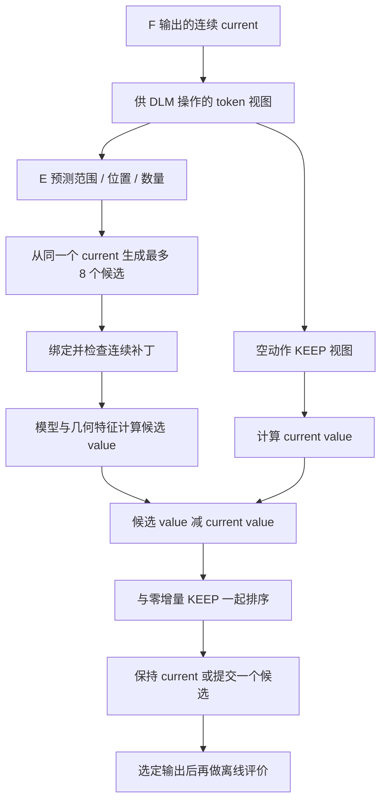
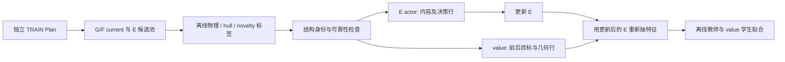

# KEEP/EDIT 机制详解：数据构造、训练和推理

KEEP/EDIT 解决一个具体问题：**拿到 G→F 已生成的晶体后，是否值得用一个有限范围的编辑替换它？** 当前机制先产生候选，再比较候选与原结构的预测增量，最终保持原样或只提交一个补丁。

这里包含两个不同部分：E 提案网络负责“改哪里、改多大、填什么”，value 网络负责“这个候选相比保持原样是否更好”。离线物理评价为 TRAIN 提供监督；推理选择使用 Plan、模型隐藏特征和几何量。

本文描述当前公开实现。较早含 known-SUN 直通、current 物理输入或辅助排序的版本单独保留在历史记录中。所有例子来自已有实验，没有重新运行模型或 CHGNet。真实数据见 [keep_edit_examples.json](../data/experiments/completed_1050/keep_edit_examples.json)，全局说明见 [框架与实验报告](FRAMEWORK_AND_EXPERIMENTS_ZH.md)。

## 1. 一个请求怎样经过 KEEP/EDIT



**F 在 E 之前只运行一次。** E 不为每个候选重新跑 F。所有候选从同一个 current 出发，第 2 个候选不会接着第 1 个候选修改。一个请求最终只提交一次选择；未选中的提案不是实际输出。

生成期间不读取当前实测能量、hull、力、应力、N/U 或教师预测。训练时通过标签影响权重，与推理时现场读取物理结果是两种不同的信息使用方式。

## 2. current、动作与实际提交的补丁

F 输出连续结构 $c=(L,F,Z)$：晶格矩阵、分数坐标和元素。DLM 操作离散视图 $b=Q(c)$，长度为 $7+4N$，排列为 N、六个晶格参数和每个原子的 element/XYZ。

动作空间为 `none`、`local_xyz`、`all_xyz`、`full_cell`。局部动作可以选择 1/2/4/8 个 site；full-cell 同时打开六个晶格参数和全部坐标。原子数、元素身份与计数固定。

必须区分**打开的位置**和**真正变化的位置**。打开一个原子的 XYZ 后，模型可以生成与原 Z 相同的 token。此时不应仅因该位置被打开过，就把原连续 Z 量化回写。

`commit_patch` 的步骤是：

1. 把提案与唯一 current 绑定，核对 N、元素和 site 对齐。
2. 比较旧/新 token，得到真正变化的数值字段。
3. 复制连续 current，只写回这些字段。
4. 检查提交后的几何。
5. 无变化、周期等价/整体刚性平移以及无效补丁按 KEEP 处理。

所以“产生了提案”“提案可提交”“最终选了 EDIT”是三件事。无效或恒等补丁即使有预测分数，也不能据此替换 current。KEEP 返回连续原结构，而不是把全结构重新量化后返回。

## 3. E 怎么决定改哪里、填什么

### 3.1 输入和网络

E 同时读取旧 current token 与正在编辑的 proposal token，附带坐标已知/未知标志、活跃位置、任务与揭示进度。周期状态模块结合元素、晶格和周期径向环境；数值适配器处理旧/新 cell 和 site。未知坐标不会被当作真实零坐标。

默认状态宽度为 128，径向基数 16，cutoff=6 Å，周期像半径 2。cell/site/task 数值适配器输入维数分别为 27/21/4；周期坐标以 sin/cos 编码，并保留可用性标志。新增数值模块保持 FP32。

DLM 最后一层的六个晶格位置平均成 $h_c$，各元素位置的 site 隐藏态平均成 $h_s$，拼成 8192 维向量 $h=[h_c;h_s]$。范围头和数量头读取 h，位置头读取各 site 向量。这些是结构表征，不是 CHGNet 的预测能量或力。

### 3.2 有限候选池

首候选使用学习到的范围、数量和位置；若范围头首先选 none，则取最高分的非 KEEP 范围生成一个候选，让它与显式 KEEP 比较。后续候选使用不同随机流，按学习到的位置排序选择单个 site。小 N 时位置可能循环，但随机流仍不同。

每个动作先 mask 相应数值 token，再逐个在类型/几何允许集内以 temperature=0.7 填充。完成后检查几何、进入 judge，再做 value 特征前向。

N=1 时，单独移动原子是整体平移，所以候选包含 cell。这是明确的表示处理规则，不能说成首轮数据学出的稳定性能力。

### 3.3 预算如何计数

一个请求共享最多 80 次额外 DLM 前向，包含 KEEP、inspect、逐 token 填充、judge 和 value 特征提取；最多 8 个候选。若剩余调用数无法完成提案，就不继续该候选。

典型单 site XYZ 提案：inspect 1 次、填 XYZ 3 次、judge 1 次、value 特征 1 次，共 6 次。8 个这样的候选再加 KEEP，对应 **49 次**。单原子 full-cell 提案更贵，当前 1050 面板实际最大为 **73 次**。80 是共享上限，不是每候选的额度，也不要求每次用满。

特征视图的 `remaining=80` 是保留的训练条件；外部计数器独立检查真正剩余的预算。F 的 1600 次 decoder 前向属于另一模型，不纳入这个 E 预算。

## 4. 最后为何选择 KEEP 或 EDIT

### 4.1 独立 value 网络

E 保留原 quality head 的接受概率作诊断。**当前最终选择不使用这个概率的 0.5 阈值**，而使用独立 value 网络。

value 将 8192 维 h 投影到 128 维并通过 SiLU，拼接 9 个几何量，用 TRAIN 统计归一化，再经 137→2 线性层输出：

```math
v=W_o\frac{[\operatorname{SiLU}(W_hh+b_h);g]-\mu}{s}+b_o.
```

几何量包括 N/20、动作 site/token 比例、是否改 cell、周期分数位移 RMS/最大值、以 current 晶格计算的 Cartesian 位移 RMS/最大值和几何可用标志。历史字段名带 `changed` 的比例量按动作范围计算；位移量按实际连续补丁计算。

两维学习 $NS=N\land S$ 和 $NMS=N\land MS$，不直接包含依赖整批顺序的 U。输出是回归值，不保证在 [0,1]，也不保证校准为概率。

### 4.2 同视图增量与精确零 KEEP

对候选 p，减去同一网络对空动作 current 视图的预测：

```math
\Delta v(p)=v(P,c,p,a)-v(P,c,c,\varnothing),\qquad
u(p)=2\Delta v_{NS}(p)+\Delta v_{NMS}(p).
```

空动作 KEEP 的增量精确为零，无需再拟合一个 KEEP 接受阈值。实际排序键为 `(utility, ΔNS, prefer_KEEP)`：

```python
winner = KEEP
best_key = (0.0, 0.0, True)
for candidate in candidates_in_saved_order:
    if not candidate.commit_applied or candidate.predicted_gain is None:
        continue
    delta_NS, delta_NMS = candidate.predicted_gain
    key = (2 * delta_NS + delta_NMS, delta_NS, False)
    if key > best_key:
        best_key, winner = key, candidate
```

负 utility 不替换 KEEP。utility 恰好为零时先看 ΔNS；若 ΔNS 为正仍可 EDIT，若两项都与 KEEP 打平则保留 KEEP。同键候选保留原顺序。比较使用完整浮点精度，没有另加接受阈值。

## 5. 两个真实推理例子

按 S0 原 ordinal 顺序取第一个 N>1、可编辑的 KEEP 和 EDIT 请求；未根据后续物理结果挑选。下表为推理时的预测增量，并非实测物理增量。

### 5.1 20 原子请求为什么 KEEP

`H1A2_1200:0001` 的 8 个提案都可提交，共用 49 次 DLM 前向，但 utility 全部小于零：

| rank | ΔNS | ΔNMS | utility |
|---|---:|---:|---:|
| 0 | -0.007836 | -0.077004 | -0.092676 |
| 1 | -0.013708 | -0.095528 | -0.122943 |
| 2 | -0.030571 | -0.124723 | -0.185865 |
| 3 | -0.013619 | -0.135132 | -0.162371 |
| 4 | -0.003883 | -0.103404 | -0.111169 |
| 5 | -0.007095 | -0.106022 | -0.120212 |
| 6 | -0.040209 | -0.157337 | -0.237755 |
| 7 | -0.027426 | -0.198047 | -0.252900 |
| KEEP | 0 | 0 | 0 |

最终保持 F 的连续 current。这里不是没有生成合法提案，而是模型预测没有一个提案优于 KEEP。

### 5.2 8 原子请求为什么 EDIT

`H1A2_1200:0004` 同样有 8 个候选、49 次前向，选中 rank 2：

| rank | ΔNS | ΔNMS | utility |
|---|---:|---:|---:|
| 0 | -0.061809 | -0.170622 | -0.294240 |
| 1 | -0.048018 | -0.103301 | -0.199337 |
| 2（选中） | +0.013727 | +0.042827 | +0.070281 |
| 3 | -0.019445 | -0.076432 | -0.115322 |
| 4 | -0.035810 | -0.087680 | -0.159300 |
| 5 | -0.019674 | -0.055863 | -0.095211 |
| 6 | -0.016769 | -0.037914 | -0.071453 |
| 7 | -0.032454 | -0.120816 | -0.185724 |
| KEEP | 0 | 0 | 0 |

rank 2 的原接受头概率约 **0.163861**，低于 0.5，仍被 value 选中。rank 7 的原接受概率还稍高，但 utility 为负。这展示了最终决策实际使用哪个分数。

rank 2 打开 0-based site 6 的 XYZ（body 位置 32/33/34），实际只改变 X/Y token：

```text
current 连续坐标：[0.7552029490470886, 0.6822143197059631, 0.8952969312667847]
提交后连续坐标： [0.74,               0.79,               0.8952969312667847]
```

Z token 未变，所以连续 Z 保持 **0.8952969312667847**，没有被回写为量化值 0.90。晶格和其他 site 也保持原值。表中分数仅为展示而取小数位，原始全精度数据公开保留。

这两个例子说明保存的选择如何发生。正 utility 是模型判断，不能直接宣称物理上一定改善；实测结果来自输出锁定后的共同评价。

## 6. TRAIN 数据如何构造



1000 个 TRAIN 条件与 1050 评估组成隔离。保存每个来源的 G、F current 和最多 8 个候选后，才做标签收集。相同几何可复用内容绑定的缓存，不同几何不能共享同一条物理标签。

### 6.1 怎样定义“有用提案”

对所需验证已通过且 hull 已知的端点，质量层级依次为：新颖且严格稳定、严格稳定、亚稳、其他已知结果。进入更好的层级构成改善；同层级、且不是最高新颖稳定层时，hull 降低超过 **0.01 eV/atom** 也构成改善。明确失败 current 的修复要求可靠端点至少进入亚稳层。

这里 0.01 是 TRAIN teacher 的同层改善门槛，0.1 是亚稳门槛；二者均不是推理时 value 的接受阈值。

正提案按质量层级、hull、较少动作位置、较早 rank 选出一个规范 teacher，同一 current 不同时使用冲突动作标签。

### 6.2 E actor 行

存在有用提案时，记录：

- `current_tokens`：当前视图；
- `proposal_tokens` / `content_target_tokens`：选定提案；
- `action_positions` / `content_positions`：动作数值位置；
- `mode_target` / `site_targets`：范围与位置标签；
- `accept_target=1`。

不存在有用提案时，取模型预测 ΔNS 较高的候选作拒绝监督，设 `mode_target=0`、`accept_target=0`，**不添加内容目标**。内容 CE 不会被要求模仿这个被拒绝的提案；局部位置/数量损失也只在局部正动作上使用。

没有好提案只支持当前有限池的 KEEP 标签，不是对整个编辑空间的最优性证明。缺少所需可靠 before/after 目标时，相关行被排除，不把未知强行转成拒绝。

### 6.3 value 行

每个可用、真正提交的候选产生一个 current/proposal 比较，包含 token、动作、9 个几何量和前后目标：

```math
y(c)=(N(c)S(c),N(c)MS(c)),\quad y(p)=(N(p)S(p),N(p)MS(p)).
```

U 与整个面板和顺序有关，不作单条 value 目标。已知 S/MS 为 false 时，即使 N 尚未计算，合取仍为 false。明确失败的零目标、未收敛和未知处理依照 `endpoint_targets`；不能概括成“所有缺失值都设为零”。

actor 每来源最多一行，value 每来源可以多行，候选行数不等于独立组成数。

### 6.4 首轮实际分布与覆盖

| 项目 | 数量 |
|---|---:|
| 原始 TRAIN 条件 | 1000 |
| 可用 E actor 来源/行 | 972 |
| 有内容目标的正动作 | **445** |
| KEEP/拒绝头监督 | **527** |
| known-SUN TRAIN 行 | 88 |
| value 候选比较 | **7766 行，972 来源** |

445 个正动作全部是 `local_xyz`，其余为 none。这轮数据没有给 all-XYZ/full-cell 正动作监督；架构支持四种模式不等于本轮已经学会所有范围。

### 6.5 两条实际标签说明什么

**正例：**来源尾号 2048、16 个 site，teacher 为 rank 2 / site 3 / body 位置 20–22。hull 从 **0.133119** 降至 **0.102650 eV/atom**，降低超过 0.01，故 `mode_target=1`、`accept_target=1`，并有内容目标。但两端仍超过 0.1，硬 NS/NMS 目标都是 `[0,0]`。

**负例：**下一条来源尾号 2049、20 个 site，判断提案 rank 1 的 hull 为 **0.092978→0.092917**，改善不足 0.01，同为新颖亚稳。它得到 KEEP/拒绝标签，无内容目标；value 前后硬目标同为 `[0,1]`，增量为零。

所以 actor 的“正提案”不等于 SUN 晋升，拒绝也不一定表示几何无效。actor teacher 容许同层能量改善，value 侧重 NS/NMS，两个目标不完全相同。正例数不能直接当成预期新增 SUN 数。

## 7. 训练分别让哪些部分学什么

### 7.1 E 内容与决策

内容损失只作用于有内容目标的动作数值位置：dense typed-token CE 加旧分布到当前分布的 KL。按来源归一化，避免长动作仅因 token 多获得更大权重。训练包含完全 mask 和部分前缀已揭示的视图。

原子块置换同步作用于 current、proposal、teacher 和 site 标签。决策部分用范围 CE、局部位置 categorical loss、数量 CE 和接受输出 BCE；known-SUN 的 TRAIN 行对范围/接受项有 2 倍权重。

决策损失 detach 内容隐藏特征，内容/状态模块由 CE/KL 学习。known-SUN 只用于离线损失加权，不进入自主推理输入。新 minibatch 配方监督 quality head 的第 4 个接受输出，保留其他输出的架构不等于给它们都添加了新的物理标签。

| 设置 | 当前配方 |
|---|---|
| E 内容 LR | 2e-6 |
| 决策头 LR | 1e-4 |
| Epoch / batch | 8 / 16 来源 |
| KL | 权重 1，软正则，不触发硬停止 |
| 优化器 | AdamW，无 weight decay，梯度裁剪 |
| 更新粒度 | 每个 minibatch 真正更新一次 |

首轮完成 488 次 minibatch 更新：**445 个内容来源各实际更新 8 遍，972 个决策来源各实际更新 8 遍**。不是 972 条都参与内容 CE。见 [训练记录](../data/experiments/completed_1050/training/E.json)和 [实际 exposure](../data/experiments/completed_1050/training/E_exposure.json)。

### 7.2 配套 value

E 更新后，用新的 E 重新抽取 TRAIN current/proposal 的隐藏特征。value 的隐藏投影从 E quality head 第一层初始化，再训练隐藏投影和最终读出；拟合阶段 E 固定。

离线教师可以额外读取 current 物理/可靠性特征。学生 after 目标混合 50% 实测标签与 50% 教师预测，再减去真实 before 标签。学生损失包含 gain MSE、前后水平 MSE、来源内 NS 排序和 ridge；学生输入始终只有模型特征与几何。

学生目标因此可以是软值。预测增量不是实测增量，教师误差也会传播。首轮使用 7766 行、972 来源，64 遍、1984 步，每行实际访问 64 次。批次按 32 个来源组织，并在来源内平均候选损失；输出层 LR=1e-3，隐藏层 LR=1e-5。

替换 E 后需重新拟合匹配的 value，因为其特征空间改变。当前包内 value 配套的是组件研究选择的初始 E，不能任意与 S1 的 E 混装。

## 8. 实际调用与保存的产物

完整推理入口：

```bash
dlm-iclr infer --config configs/local.json --plan-source H1A2_1200 \
  --legal-only --requests 1050 --gpus 5 --output outputs/sample
```

`Editor.edit` 接收 Plan 和 F 包装对象，使用 E 与匹配 value。`E/` 保存候选、预算、补丁、增量与选择；`structures.jsonl` 是评价使用的最终输出。

如需用已构造的 TRAIN 反馈拟合 value：

```bash
dlm-iclr train value --config configs/local.json \
  --data outputs/train/feedback/value.jsonl --output outputs/value-update
```

该命令需要已有 TRAIN 反馈，不会把评估集评分自动变成训练数据。详细资产和格式见 [整体框架](FRAMEWORK_AND_EXPERIMENTS_ZH.md)及 [资产说明](assets.md)。本次只是整理已有结果，后续自提升保持停止。

[数据核验脚本](../scripts/verify_experiment_data.py)能够不加载模型地重放两例排序、检查 KEEP 和未变字段、核对训练 exposure。它重放的是保存分数下的决策，不冒充重新执行神经网络。

## 9. 为什么有这个机制仍可能没有 SUN 净收益

- 有限候选池可能没有真正的好编辑，范围监督也可能很窄；本轮正动作全是局部 XYZ。
- actor 的同层 hull 改善与 value 的 NS/NMS 目标不完全一致。
- 旧候选池用于训练，新 E 会改变提案分布；重新抽取特征不能消除全部分布变化。
- 预测 utility 有误差，NS/NMS 也没有直接包含整批 U。
- 指定 CHGNet/参考协议的阈值附近误差、未收敛和缺失参考限制了结论。

完整 1050 对照中，EDIT 从 495 增到 669，但可比较部分 SUN 为 27 得、32 失，净 −5；MSUN 为 124 得、122 失，净 +2。96 个新组成组件面板也同时出现收益和损伤。候选生成、连续 KEEP 和实际训练更新都已验证，但“更多编辑”“更低 CE”或“更多更新步数”不能代替物理质量提升的证据。

1050 对照同时更新了 G、E、value，不能把净变化完全归因于 KEEP/EDIT 或其中一个模块。E 固定组成；该对照中 comp_valid 的一个新增来自原生成失败请求恢复为可重建结构，并不是 E 改写元素计数来满足 SMACT。
