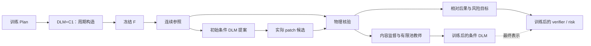

# CrystalDLM: Periodic Construction and Physical-Feedback Learning for Crystal Generation

**周期关系构造与物理反馈驱动的条件重构**

完整方法故事稿 · 2026-09-20

**主实验保持原绑定：本次仅调整科学动机、反馈机制的表述与模块衔接，不改变既有数据、训练资产、生成顺序、运行配置、评价口径或结果。**

本文集中说明科学动机与学习机制；运行配置和历史结果的复现条件见[实现与复现说明](https://github.com/YWDDLiang/DLM_ICLR/blob/codex/verified-feedback-train-20260920/docs/keep-edit-implementation.md)。

本文以既有 KEEP/EDIT 方法为实现基础，重新组织科学动机、方法与数学。正文聚焦方法，不填入尚未按本叙事核对的实验成绩。首次生成器的反馈更新与减少部署精修依赖作为后续方向，和本文已经实现的条件重构学习分开说明。

## Abstract

Crystal generation requires coordinated lattice and periodic coordinate prediction. Discrete field prediction offers a flexible representation of crystal structures, but token-wise scores do not automatically encode compatibility among unresolved positions, and likelihood-based training does not directly specify which structural changes are physically preferable. We present CrystalDLM, which connects periodic relational construction with physical-feedback learning of conditional reconstruction. First, lattice-conditioned periodic interactions couple DLM coordinate candidates through a tractable tree distribution, whose joint proposals are integrated into the actual masked construction procedure. A frozen continuous diffusion model transforms the resulting draft into a continuous structural reference. Second, a geometry-conditioned DLM proposes masked reconstructions around this reference, while continuous patching preserves unchanged numerical fields. Physical evaluation of the reference and executed candidates supplies reconstruction targets, a finite-candidate reward-weighted teacher, and supervision for relative KEEP/EDIT verification. These signals train the conditional DLM and its value model, allowing previously measured physical experience to inform subsequent reconstruction decisions. A bounded remasking step can additionally use completed context and learned geometric risk to revise a candidate. By separating continuous proposal formation, physical supervision, and learned conditional decision-making, CrystalDLM provides a concrete route for incorporating physical feedback into discrete crystal modeling.

## 中文摘要

晶体生成需要共同确定晶格和周期原子排布。离散字段能够表达晶体结构，但逐位置评分不会自动约束待定位置之间的相容性，基于似然的训练也不会直接规定哪些结构改变在物理上更可取。CrystalDLM 将周期关系构造与物理反馈驱动的条件重构结合起来：首先，C1 在 DLM 坐标候选中引入晶格条件化的周期相互作用，通过可计算的树分布形成联合提案，并接回实际构造过程；随后，冻结的连续 diffusion 为 draft 建立连续结构参照。C2 围绕该参照提出 masked 重构候选，仅回写变化字段，保留其余连续几何。对参照及实际执行候选的物理评价被转化为重构目标、有限候选物理教师和相对 KEEP 的验证监督，用于训练条件 DLM 与价值模型。完整候选还可进行一次受限的风险引导重掩码。由此，连续结构计算所提供的物理经验能够进入条件生成模型的参数，并在之后的重构决策中复用。

---

# 1. 一句话主线

> **CrystalDLM 用周期关系组织 DLM 的晶体构造，并把连续结构上的物理核验结果转化为条件重构与保留决策的学习信号，使几何提案既有关系结构，也能吸收物理反馈。**

全文围绕两种学习展开：

1. **C1 学习位置怎样在周期结构中共同成立。**
2. **C2 学习在给定结构参照下，哪些条件重构值得生成和采用。**

两项贡献分别落在候选分布与反馈目标上：

$$
\boxed{
\underbrace{\text{周期关系进入候选分布}}_{C1}
\quad+\quad
\underbrace{\text{物理后果进入条件学习}}_{C2}
}
$$

Frozen F 连接这两部分：它将周期关系感知的离散 draft 转为连续结构参照。物理工具为参照及其替代候选提供后果标签；C2 将这些标签编译为可复用的模型监督。

本稿中的“条件重构”对应已有的局部 mask、条件填充、连续 patch 和 KEEP/EDIT 选择。它仍在推理时处理 F 输出，但方法主线着重解释其学习来源与决策目标。

---

# 2. 从第一性原理出发：论文在解决什么问题？

## 2.1 Challenge 1：晶体质量取决于整体周期配置

### Science｜Why

给定组成，只知道原子种类与数量，并不能确定晶体。一个原子位置的意义依赖于晶格、其他原子及其周期映像。分别合法的数值，组合后可能产生碰撞、不合理配位或其他几何问题。

因此，构造对象是共同成立的周期配置。连续晶体生成中的联合晶格与分数坐标建模，也建立在这一结构特征之上。[DiffCSP](https://arxiv.org/abs/2309.04475)

### Math｜Why

晶体记为 $C=(A,L,R)$，其中 $A$ 是原子种类，$L$ 是行向量排列的晶格矩阵，$R=\{r_i\}_{i=1}^{N}$ 是分数坐标。周期距离为：

$$
d_{ij}(C)=\min_{n\in\mathbb Z^3}
\left\|(r_i-r_j+n)L\right\|_2.
$$

改变晶格或任一原子位置，都可能改变同一组局部环境。几何关系必须体现在候选组合中。

### Computer｜Why

masked DLM 可以让多个待定字段共享可见上下文，但同次输出的逐位置 logits 不会自动成为一个显式耦合的联合候选分布。模型接口允许条件预测，仍需要机制把多个预测组织成相容的配置。

### 人话

> 每个位置各自看起来合理，还不够；这些位置需要一起放得合理。

由此得到第一个技术问题：**如何把周期关系直接引入待定坐标的候选分布？**

## 2.2 Challenge 2：结构计算的物理后果不会自动进入离散模型

### Science｜Why

连续 diffusion 能给出不同于离散 draft 的晶格和坐标配置；原子间势弛豫与核验能够给出能量、力、应力及终态相关信息。这些信息描述了具体结构的后果，但不会自动成为 DLM 的学习目标。

离散表示并不排斥几何学习。真正的问题是：**学习晶体字段的条件概率，并不自动等同于学习这些字段组合后的物理可取性。**

### Math｜Why

设连续参照为 $S$，在其上执行局部重构得到 $C$。一次核验给出：

$$
(S,C)\longrightarrow\bigl(\mathcal V(S),\mathcal V(C)\bigr).
$$

要让后续请求利用这次经验，还需要：

$$
\bigl(S,C,\mathcal V(S),\mathcal V(C)\bigr)
\longrightarrow
(\eta',\phi'),
$$

其中 $\eta$ 是条件重构 DLM 的参数，$\phi$ 是相对验证模型的参数。

### Computer｜Why

物理反馈需要被编译成两类可训练对象：一类告诉 DLM 在什么上下文下应该填入哪些字段，另一类告诉验证模型候选相对保留原结构是否更可取。学习对象与实际执行结构必须一致，特别是不能用一个结构的标签监督另一个量化后或 patch 后的结构。

### 人话

> 测出哪种改法更好，还要把这次经验变成模型以后会用的能力。

由此得到第二个技术问题：**如何把连续参照上的实际结构后果，变成条件 DLM 和验证模型能够学习的监督？**

## 2.3 统一的科学问题

> **如何让离散晶体模型同时利用周期几何关系与可测的物理后果，形成可复用的结构构造和条件重构能力？**

| 子问题 | 关注对象 | 方法对应 |
|---|---|---|
| 哪些位置组合具有周期相容性？ | 生成时的候选关系 | C1 周期联合提案 |
| 哪些条件重构值得学习与采用？ | 候选的物理后果与相对偏好 | C2 反馈学习与验证 |

相容性与物理质量有关，但二者并不等价。C1 显式建模关系，C2 利用物理后果进行条件学习；二者的效果都需要在实际生成与评价中检验。

---

# 3. 为什么采用 DLM？

## 3.1 统一的字段条件接口

首次构造面对的是：给定组成、晶格或部分坐标，尚未确定的字段怎样生成？条件重构面对的是：给定完整参照和当前候选，重新开放的字段怎样生成？两种情形都适合用 masked conditional prediction 表达。

LLaDA 提供基于遮罩与恢复的语言建模方式；这里采用其条件预测接口来表示晶体字段。[LLaDA](https://arxiv.org/abs/2502.09992)

首次构造的一元预测为：

$$
p_\theta(y_j\mid P,y_{\bar M},M),\qquad j\in M.
$$

条件重构增加固定参照 $y^0$：

$$
p_\eta(y_j\mid P,y^0,\hat y_{\bar M},M).
$$

这里 $P$ 为 Plan，$y^0=Q(S)$ 为连续参照的 token 视图，$\hat y$ 为正在形成的候选。C1 进一步耦合首次构造的一元坐标候选；C2 在局部填充过程中利用固定参照及更新后的可见字段。

## 3.2 模型接口统一，任务参数明确区分

| 参数/模型 | 作用 |
|---|---|
| $\theta$ | 首次 draft 所用 DLM/B0 参数 |
| $\psi$ | C1 周期关系头 |
| $\eta$ | 几何条件编辑 DLM、任务适配及相应决策头 |
| $\phi$ | 相对 KEEP 的价值模型 |
| $\omega$ | 可选的几何风险模型 |

已有方法使用各自的任务资产。条件 DLM 从相关基础模型初始化，并不意味着其反馈更新会自动写回首次生成器，也不意味着 C1 会跟着重训。

## 3.3 为什么适合本方法

DLM 可以对指定字段重新遮罩，在保留其余上下文的条件下生成；每次提交后还可以重新前向，以更新后的配置预测剩余字段。同次前向的 hidden 与 logits 也为周期关系头和候选价值读出提供了接口。

这种选择的依据是条件几何建模的便利性。其他架构也可能实现相应条件生成，本文不依赖 DLM 的架构独占性主张。

### 人话

> DLM 可以在晶体尚未完成时补位置，也可以在已有参照时重新考虑一小部分位置。两种任务共享条件预测的语言，但需要各自对应的训练。

---

# 4. 完整系统故事：周期构造、连续参照与反馈学习

## 4.1 离线训练路径

```text
训练 Plan
   ↓
已训练的 B0 DLM + C1 构造 draft X
   ↓
冻结连续 diffusion F
   ↓
连续参照 S ─────────────────────────────┐
   ↓                                   │
初始几何条件 DLM 提出局部候选             │
   ↓                                   │
在 S 上执行连续 patch，得到候选 C          │
   └─────────────────┬─────────────────┘
                     ↓
       同一物理协议评价 S 与实际候选 C
                     ↓
        监督编译：重构目标、KEEP 决策、
          有限池教师、相对后果与风险
                     ↓
          更新条件 DLM 与相应决策头
                     ↓
       用最终 DLM 表示拟合 value，拟合 risk
                     ↓
          后续请求复用条件重构策略
```

这里是一轮离线反馈训练的完整数据流。结构经验返回条件模型参数；没有要求每处理一个新请求都重新训练，也没有默认加入多轮新 Plan 自采样。

## 4.2 推理中的学习型核心

```text
Plan → DLM+C1 → raw draft X → F → 连续参照 S
                                      ↓
                            条件 DLM + 连续 patch
                                      ↓
                             候选及可选一次重掩码
                                      ↓
                           相对 verifier 比较 KEEP
                                      ↓
                               提交结构 → 统一评价
```

## 4.3 物理反馈怎样回到条件模型



反馈图明确标出学习对象：物理后果进入条件 DLM 与验证模型。训练后的模型供后续参照上的重构请求复用，首次 B0+C1 的参数保持独立。

---

# 5. Planner 在故事中的位置

Planner 提供组成及粗结构条件 $P$，固定原子种类与数量，定义后续构造和反馈比较的任务。C1、F 与 C2 在同一个请求的条件下处理几何。

已有离线反馈训练可以使用保存的训练 Plan，不要求每轮生成全新的 Plan。复用时保留来源、顺序、随机种子与训练曝光信息，确保参照及候选确实属于同一条件。

### 人话

> Planner 给出要构造什么；后续模型决定几何，物理核验提供这些几何选择的后果。

Planner 持续刷新条件可以作为多轮方法的扩展，但不是本稿当前学习流程成立的前提。

---

# 6. 贡献一 C1：晶格条件化的周期联合候选构造

## 6.1 Why：关系应进入候选分布

各位置共享上下文仍不足以显式表达“候选之间怎样搭配”。C1 在 DLM 一元评分上增加周期关系势，让同一轴上的坐标候选受到共同配置的约束。

## 6.2 What：可计算的周期树分布

令当前状态为 $s$，当前轴的网格坐标为 $z=(z_1,\ldots,z_N)$，周期支持大小为 $Q=100$。定义：

$$
\Phi_{\theta,\psi}(z;s)=
\sum_i\ell_{\theta,i}(z_i;s)
+\sum_{(i,j)\in T}
g_{\psi,ij}((z_i-z_j)\bmod Q;s),
$$

$$
q_{\theta,\psi}(z\mid s)=
\frac{\mathbf 1[z\in\Omega_s]}{Z_{\theta,\psi}(s)}
\exp\!\left(\frac{\Phi_{\theta,\psi}(z;s)}{\tau}\right).
$$

$\ell$ 来自 DLM 同次前向；$g$ 是晶格条件化的周期关系势；$T$ 为固定可计算树；$\Omega_s$ 表示字段支持及已知证据。关系头结合 hidden、元素、晶格与可见几何信息，用周期参数化表达坐标差。

## 6.3 How：训练与推断

在训练晶体的部分可见视图上，目标轴为 $z^*$：

$$
\mathcal L_{C1}
=\log Z_{\theta,\psi}(s)
-\frac{\Phi_{\theta,\psi}(z^*;s)}{\tau}.
$$

训练 C1 时首次生成 DLM 保持冻结，更新关系头。树上消息传递以 $O(NQ^2)$ 复杂度计算归一化、条件边缘与联合样本，避免枚举 $Q^N$ 个组合。

## 6.4 联合候选如何进入真实构造

若提交规则为 $a=H_s(z)$，则由辅助候选诱导的动作核为：

$$
K_1(a\mid s)=\sum_{z:H_s(z)=a}q_{\theta,\psi}(z\mid s).
$$

这是对实际提交机制的数学描述。执行程序依照既有置信与支持规则提交字段，然后重新运行 DLM、更新状态与候选分布；并不计算整条构造轨迹的精确似然。

因此，C1 的对象是当前轴的联合候选及其实际构造作用，不能扩写为一次性精确采样全部晶格和 XYZ 的全局分布。

## 6.5 Science / Math / Computer / 人话

**Science：** 周期位置的合理性取决于相互关系。

**Math：** 用可归一化关系势耦合一元候选。

**Computer：** 复用同次 hidden/logits，通过树推断接回逐字段提交。

**人话：** 先让候选考虑怎样搭配，再按构造规则落定位置。

CoDD 提供可计算结构化输出的相关基础；本方法的具体设计落在晶体周期参数化、几何条件和实际提交接口上。[CoDD](https://arxiv.org/abs/2603.00045)

---

# 7. Frozen diffusion 的定位：从离散提案到连续参照

## 7.1 为什么 C1 后仍需要连续处理

C1 在有限词表支持上组织候选。连续晶格和分数坐标还有词表分辨率之外的自由度。Frozen F 接收 draft 的晶格与坐标，在组成保持固定的条件下进行连续处理：

$$
X\sim G_{\theta,\psi}(\cdot\mid P),
\qquad S\sim K_F(\cdot\mid X).
$$

这一模块沿用语言提案与连续精修结合的既有框架；连续模型的贡献与本方法新增的 C1/C2 分开归属。[CrysLLMGen](https://arxiv.org/abs/2510.23040)

## 7.2 F、物理工具和验证器各自负责什么

| 对象 | 实际职责 | 提供的信息 |
|---|---|---|
| Frozen F | 学习得到的连续去噪/结构精修 | 连续晶格与坐标参照 |
| 物理弛豫与核验 | 按固定协议计算结构后果 | 能量、力、应力、终态与相关标签 |
| learned verifier | 学习候选相对 KEEP 的后果 | 可用于选择的相对预测 |

F 的去噪目标不直接等同于评价使用的物理目标，也没有一个已经输出精确错误字段的诊断接口。因此，候选是否更好由物理核验确定，不能直接把 F 的变化方向当成正确性标签。

## 7.3 为什么 F 后还存在条件重构

F 输出提供了完整结构参照，使 DLM 能在已知整体几何的条件下重新开放少量字段。围绕这一参照产生的候选，能够被同一物理协议比较，并转化为内容与验证监督。

训练时，这些后果进入条件 DLM 和 value 的参数。推理时，模型应用已学到的条件策略，比较 KEEP 与有限候选。**这正是 C2 反馈学习的实际使用位置。**

这给出了增加条件重构的研究动机。其增量价值仍需要在相同 F 输入上通过候选质量、选择质量和成本验证；“F 不是物理最优保证”本身不能证明 C2 有效。

## 7.4 为什么这种重构不会必然丢掉全部精修精度

模型以 token 视图判断和提案，实际提交时保留原 F 的连续结构，仅回写数值发生变化的字段。未改变区域不经历全量 token 解码。

这一执行方式保存了未编辑字段的连续精度，但修改仍可能产生新的物理问题。因此需要相对 KEEP 验证以及统一的最终评价，不能由 patch 的局部性推出整体质量保证。

### 人话

> F 给出连续参照，物理计算告诉我们在这个参照上哪些改法更可取，DLM 学习怎样提出这些改法，验证模型学习哪些值得采用。

---

# 8. 贡献二 C2：物理反馈驱动的条件重构与验证

## 8.1 Why：将可测后果变成条件学习

相同组成和参照下，局部候选可能改善、保持或损害最终物理结果。C2 的任务是把这些差异转成学习信号，同时保留具体字段目标和 KEEP 这个可执行选项。

它包含两个相连的学习对象：

- **条件生成模型**学习在给定几何参照下怎样重构。
- **相对验证模型**学习候选是否值得替代原结构。

## 8.2 What：参照条件下的离散重构核

令连续参照为 $S$，其 token 视图为 $y^0=Q(S)$。条件模型同时使用固定参照和正在变化的候选视图。

在候选的第 $t$ 次填充中，状态为：

$$
s_t^E=(P,y^0,\hat y_t,M_t).
$$

固定参照提供原始结构上下文，$\hat y_t$ 提供当前候选及已提交字段，$M_t$ 指明尚需填充的字段。实际逐字段预测、采样与提交过程共同定义：

$$
\hat y_{M_k}^{(k)}\sim
K_\eta(\cdot\mid P,y^0,\hat y_{\bar M_k}^{(k)},M_k).
$$

$K_\eta$ 表示程序执行的条件填充核，不假定整个候选来自同一次前向的独立采样。每次提交后更新上下文，并继续前向。

编辑网络的几何条件主要从原/当前 token 视图中派生；保存的未量化 F 结构用于连续 patch 及相应几何计算。不能把这两条信息路径混写成 DLM 直接接收了全部连续精度。

## 8.3 Step 1：形成有限候选，而不是无约束重写

候选范围来自学习的 mode/count/site 输出与固定组织规则的组合。既有版本包括局部 site 范围、全坐标和 cell 模式；后续候选可按学习的 site 排序组织。单原子结构使用 cell 提案，以避开只有整体平移意义的位置修改。

因此，$M_k$ 不应被描述成由一个纯随机神经策略独立抽样的全部动作。模式头的 STOP 输出也不等同于立即取消全部候选；最终 KEEP 由候选比较机制决定。

候选保留为有序记录：

$$
b_k=(\hat y^{(k)},a_k,C_k),\qquad
C_k=\operatorname{Patch}(S,y^0,\hat y^{(k)}),
$$

$$
\mathcal B_\eta(S)=(b_0,\ldots,b_K).
$$

候选数与逻辑 DLM 调用数受到固定预算限制。后续学习与选择都定义在实际产生的候选之上。

其中动作记录 $a_k$ 包含提案模式及实际开放字段等信息；KEEP 记录 $b_0$ 使用原参照 token、空动作和 $C_0=S$。不同候选即使具有相同执行结构，也不默认合并。物理标签与效用作用于 $C_k$，教师分布作用于记录索引 $k$，模型评分还依赖提案视图和动作范围。因此，不能仅根据结构身份复用 value/risk 读出。后文的 $\mathcal C(S)$ 表示这些记录的结构分量序列 $(C_0,\ldots,C_K)$，不是去重后的结构集合。

## 8.4 Step 2：执行结构与学习标签必须一致

记真正发生数值变化的字段集合为 $J_k$。对晶格参数或分数坐标字段 $j$，执行结果为：

$$
[C_k]_j=
\begin{cases}
D_j(\hat y_j^{(k)}), & j\in J_k,\\
S_j, & j\notin J_k.
\end{cases}
$$

例如，某坐标的原连续值对应一个网格 token，重构后 token 未变，该坐标就保留原连续值，不退回网格中心。周期别名若代表同一实际数值，也不构成有效修改。晶格变化时，笛卡尔坐标需使用新晶格重算；“保留未改字段”不等于所有笛卡尔位置不变。

程序还检查组成、字段支持、几何合法性及刚性平移等情形，无效 patch 回退到原结构。KEEP 是完整的恒等操作。

**监督标签绑定的对象是实际执行结构：**

$$
\boxed{
\mathcal V(C_k)
=\mathcal V\!\left(
\operatorname{Patch}(S,Q(S),\hat y^{(k)})
\right).
}
$$

这将连续—离散接口中的关键要求落实为“执行结构核验”。如果以后把同一候选转为从零生成的全 token 教师，输出对象会变成 $D(\hat y)$，需要另外核验，不能直接继承此处的 patch 标签。

### 人话

> 模型到底改出了哪份结构，就测哪份结构，并用这份结构的后果来训练。

## 8.5 Step 3：物理工具提供结构后果

参照 $S$ 与候选 $C_k$ 使用相同的物理协议。既有流程利用 CHGNet 弛豫及核验、hull 参考和结构匹配产生标签；CHGNet 是学习得到的原子间势，本文的核验指该固定代理协议中的结果。[CHGNet](https://arxiv.org/abs/2302.14231)

需要区分提交结构及弛豫终态。常规稳定性标签来自既定弛豫终态；新颖性与唯一性按既定评价协议在提交结构上判断。原生能量、力、应力是另外保留的诊断对象。

令 $N(C)$ 为新颖性，$\mathrm{St}(C)$ 和 $\mathrm{MSt}(C)$ 为按协议核验的稳定/亚稳定指标，亚稳定包含稳定。单结构目标为：

$$
t(C)=
\begin{bmatrix}
NS(C)\\NMS(C)
\end{bmatrix}
=
\begin{bmatrix}
N(C)\,\mathrm{St}(C)\\
N(C)\,\mathrm{MSt}(C)
\end{bmatrix}.
$$

完整候选物理教师使用代理效用：

$$
u(C)=\frac{2NS(C)+NMS(C)}{3}.
$$

未知标签与协议确认的失败分开处理。没有可靠结果时，不通过填负标签制造偏好；失败、未知及缺失候选仍保留在评价记录和请求分母中。

Unique 取决于整个集合和顺序，不能作为固定的单结构教师标签。最终 SUN/MSUN 必须在完整输出集合上重新计算。

## 8.6 Step 4：将核验结果编译成内容与决策监督

训练首先对基础几何编辑模块做已知腐化重建，使其学习范围选择和条件填充。随后在训练 Plan 产生的连续参照上收集候选，再按实测后果编译反馈数据。

原编辑监督依据固定的质量等级和 hull 改善规则，在可靠候选中选择目标。对于具有可信改进的来源，保留具体目标 token、实际作用字段、范围/位置和接受标签；没有可靠改善时，按照可用标签形成相应 KEEP 决策监督。不能把所有未测来源都当作“应当 KEEP”的已知物理负例。

内容训练沿实际 fill 路径选择训练视图。记来源 $s$ 的监督字段为 $M_s$，该字段实际训练上下文为 $\nu_{s,j}$，则内容目标可概括为：

$$
\mathcal L_{\rm content}=
\mathbb E_s\left[
\frac{1}{|M_s|}\sum_{j\in M_s}
\left(
-\log p_\eta(y_j^*\mid\nu_{s,j})
+\lambda_{\rm KL}
\operatorname{KL}(p_{{\rm ref},j}\Vert p_{\eta,j})
\right)
\right].
$$

内容目标在存在内容监督的来源上计算；不同字段使用相应类型支持。按来源归一化，避免修改字段更多的来源仅因 token 更多而支配损失。决策头另有 mode/count/site 与接受监督；无内容目标的 KEEP 来源仍可为决策部分提供训练。

既有实现对决策头使用分离的学习设置，部分决策特征采用 detach。这里是有监督的条件策略拟合，不需要梯度穿过 F 或物理引擎。

## 8.7 Step 5：有限候选物理教师如何表达偏好

已有候选池包含 KEEP 与可执行候选。以 $C_0=S$ 表示 KEEP，定义相对效用：

$$
A_k=u(C_k)-u(S),\qquad A_0=0.
$$

对于具有完整可用效用的保留池，设参考分布为 $p_0$，构造教师：

$$
q_T(k\mid S)=
\frac{p_0(k)\exp(A_k/\beta)}
{\sum_jp_0(j)\exp(A_j/\beta)}.
$$

其数学解释是：

$$
q_T=\arg\max_q\left[
\mathbb E_q[A]-\beta\operatorname{KL}(q\Vert p_0)
\right].
$$

令 $Z=\sum_jp_0(j)\exp(A_j/\beta)$，则：

$$
\mathbb E_q[A]-\beta\operatorname{KL}(q\Vert p_0)
=\beta\log Z-\beta\operatorname{KL}(q\Vert q_T).
$$

因此 $q_T$ 是有限支持上的正则化最优分布。旧实现使用保留候选记录索引上的均匀 $p_0$，包含 KEEP，并不先按几何结构去重；以固定混合比例从教师抽取目标，其余保留原编辑监督，再进行轻量条件训练。标签不完整或缺乏有效对比时沿用原监督。

教师倾向高效用候选，但不是只输出已知正增益的硬选择器。有限池、抽样与模型拟合都会限制最终收益。该公式也不代表部署整条 DLM 轨迹的精确概率。

### 与偏好学习及 DPO 的关系

物理后果通过 $q_T$ 影响 DLM 学习哪些条件输出，因而可以称为物理偏好引导的条件学习。实际训练通过教师目标、内容重构、参考 KL 和决策监督落实；没有直接实现 matched-mask 正负概率比的 DPO 损失。

奖励引导的教师蒸馏提供了相关思想背景，但这里采用的是既有有限候选监督方式，没有复刻完整的多轮 roll-in/roll-out 算法。[VIDD](https://arxiv.org/abs/2507.00445)

### 人话

> 候选都测过之后，让更可取的答案更有机会成为老师，再教条件 DLM 学会怎样写出这种答案。

## 8.8 Step 6：学习相对 KEEP 的验证模型

候选生成与候选选择是两个不同问题。验证模型读取最终条件 DLM 对参照/候选的表示，以及对应几何变化特征：

$$
v_\phi(S,C;\hat y,a)=
\operatorname{Head}_\phi
\bigl(f_{\eta^*}(P,Q(S),\hat y,a),g(S,C,a)\bigr)
\in\mathbb R^2.
$$

以下将同一条候选记录的完整读出简写为 $v_\phi(S,C)$，将相应特征简写为 $f_{\eta^*}(S,C)$ 和 $g(S,C)$。KEEP 使用原参照 token 与空动作；候选使用自身的提案 token 和开放字段。风险读出的简写也保留其对应动作范围，不表示它只是两个连续结构的函数。

两维对应 $NS$ 和 $NMS$ 的读出。相对预测为：

$$
\Delta v_\phi(S,C)=v_\phi(S,C)-v_\phi(S,S).
$$

采用同一个网络和参照进行两次评分，KEEP 的相对值严格为零。读出是回归值，不能未经校准当作位于 $[0,1]$ 的概率。

基础选择分数为：

$$
J_0(S,C)=2\Delta v_{NS}(S,C)+\Delta v_{NMS}(S,C).
$$

按照固定的主分数、次级严格目标及 KEEP 同分规则，在有效候选和 KEEP 中选择。保留动作提供了参照点，但预测误差仍可能导致错误选择。

### 两种“教师”应当分清

有限候选教师 $q_T$ 用来影响 DLM 的内容和决策监督。value 训练还使用另一个离线小教师：它可以读取当前参照的已测物理特征，辅助学习候选的 $NS/NMS$ 软目标。

记该离线教师为 $T_\chi$，当前参照物理特征为 $m(S)$：

$$
\widetilde t(C)=
(1-\alpha)t(C)
+\alpha T_\chi\bigl(f_{\eta^*}(S,C),g(S,C),m(S)\bigr).
$$

部署 value 学习以下相对目标：

$$
\widetilde{\Delta t}(S,C)=\widetilde t(C)-t(S).
$$

其损失包括相对增量回归、参照/候选绝对读出的轻度监督、按真实严格目标差形成的同来源排序，以及读出正则。组成可写为：

$$
\mathcal L_v=
\mathbb E_{S}\left[
\mathbb E_{C\mid S}
\left\|
\Delta v_\phi(S,C)-\widetilde{\Delta t}(S,C)
\right\|_2^2
+\lambda_a\mathcal L_{\rm anchor}(S)
+\lambda_r\mathcal L_{\rm rank}(S)
\right]
+\lambda_w\mathcal R(\phi).
$$

这里首先平衡来源，再在来源内聚合候选；该式概括实际损失组成，具体系数及特征定义由固定实现给定。

离线物理教师的 $m(S)$ 不作为部署 value 的输入。部署读出只使用模型表示与几何特征。

### 为什么 value 要匹配最终编辑器

编辑 DLM 更新后，其 hidden 会变化。如果 value 仍沿用旧表示训练，输入和部署表示可能不匹配。因此，既有流程在轻量教师更新之后，使用最终编辑器重新提取参照/候选特征并拟合 value。

这一步属于编辑模型与验证读出的匹配，不是 C1 的重新适配。

## 8.9 Step 7：利用完整候选做一次受限重掩码

逐字段生成时，早提交的字段没有看到所有后续候选值。完成一个候选后，可以在完整上下文中重新开放少数字段，提出一个受限的替代。这借鉴了 DLM 重掩码利用更丰富上下文的思想。[RemeDi](https://arxiv.org/abs/2509.23653)

既有一次修订版本仅处理原赢家为单 site `local_xyz`、实际改动也限于一个 site、且晶格未变化的情形。在调用预算允许时，从该候选 $\bar C$ 中检查最多三个实际改动的坐标字段。原连续参照 $S$ 保持不变，其他候选字段作为可见条件；KEEP、cell 或其他不适用路径保留原选择。

风险模型 $\widehat r_\omega(S,C)$ 预测固定物理预算下的无效或不收敛倾向。对一个字段 $j$，在其合法值 $k$ 上倾斜 DLM 分布：

$$
q_\lambda(k)\propto
p_\eta(k\mid S,\bar C_{-j})
\exp\!\left[-\lambda\widehat r_\omega
(S,\bar C^{j\leftarrow k})\right].
$$

公式中的 $S$ 简写其合法参照条件；DLM 的实际原/当前视图仍按前述接口构建。风险计算使用对应连续 patch 的实际几何。

这是以下有限支持问题的解：

$$
\min_q\left[
\operatorname{KL}(q\Vert p_\eta)
+\lambda\mathbb E_q[\widehat r_\omega]
\right].
$$

当基础分布、支持和预测风险固定时：

$$
\frac{d}{d\lambda}\mathbb E_{q_\lambda}[\widehat r_\omega]
=-\operatorname{Var}_{q_\lambda}(\widehat r_\omega)\le 0.
$$

这说明倾斜降低的是模型预测的期望风险；不保证真实物理风险或稳定性单调改善。实现对倾斜强度、KL 距离、触发门槛和总调用数设有限制。在被检查的字段中选择预测期望风险下降最大的一个字段，至多采样一次形成附加候选 $C'$，再为它重新提取自己的 value 特征。

只有通过适用性、基线风险及预期风险下降门槛，才进入相对风险重排；未通过时返回原基础选择。进入重排后的分数为：

$$
J(S,C)=J_0(S,C)
-\mu\bigl[
\widehat r_\omega(S,C)-\widehat r_\omega(S,S)
\bigr].
$$

KEEP、原赢家及实际形成的可执行附加候选按固定规则比较。通过门槛但未形成新候选时，重排仍可比较 KEEP 与原赢家。该步骤是一轮推理中的有限修订，不是多轮参数反馈训练，也没有在 C2 后再运行一轮 diffusion。

## 8.10 Step 8：形成可复用的条件策略

整体学习路径为：

$$
\mathcal D_{
\rm ref,cand,phys}
\longrightarrow
\eta^*
\longrightarrow
f_{\eta^*}
\longrightarrow
\phi^*,
\qquad
\mathcal D_{\rm geometry,outcome}
\longrightarrow\omega^*.
$$

随后多个请求都使用固定的 $(\eta^*,\phi^*,\omega^*)$。训练中的物理计算经验已经进入参数；推理不需要重新拟合这些模型。

本版本的 C2 更新对象是条件重构模型及其读出。首次生成器 $(\theta,\psi)$ 没有被这条训练流程自动更新。保持这一参数区分，才能准确说明反馈目前学到了哪里。

## 8.11 Contribution statement

> **Physical-feedback learning of conditional reconstruction.** We physically evaluate continuous-reference structures and executed masked reconstruction candidates, and compile their outcomes into conditional DLM supervision, finite-candidate teacher targets, and learned relative verification against KEEP. This trains a reusable reconstruction policy while preserving unchanged continuous geometry at execution.

---

# 9. C1 与 C2 为什么属于一套方法？

## 9.1 两者对应离散晶体建模的两个缺口

C1 处理候选之间的周期关系；C2 处理条件输出与物理后果之间的对应。前者决定怎样组织结构提案，后者决定怎样从已经测得的后果中训练条件提案和选择。

| 维度 | C1 | C2 |
|---|---|---|
| 主要输入 | Plan 与部分可见结构 | Plan、F 参照与当前候选 |
| 主要学习信息 | 训练晶体的周期关系 | 参照和重构候选的已测后果 |
| 核心数学对象 | 周期联合候选分布 | 条件重构核、物理教师与相对价值 |
| 几何作用 | 耦合待定位置候选 | 在完整参照下重新生成受限字段 |
| 参数作用 | 训练周期关系头 | 训练编辑 DLM 及 value/risk |

## 9.2 C1 的输出决定 C2 面对的结构来源

数据路径明确相连：

$$
P\longrightarrow G_{\theta,\psi}
\longrightarrow X
\longrightarrow K_F
\longrightarrow S
\longrightarrow\mathcal D_{C2}.
$$

训练 C2 的参照来自这套构造与精修过程，因此 C1、F 的数据分布会影响 C2 学习到的条件任务。它们不是任意拼接而毫无来源关系的模块。

这种联系是任务、数据与条件表示上的联系。既有版本没有让 C2 的梯度回传到 C1，也没有证明它们联合训练。论文应以真实联系组织方法，并通过同一执行链上的控制比较验证各部分作用。

## 9.3 跨过 F 之后，C1 的贡献仍需实测

连续模块可能保留、改变或削弱输入提案差异。C1 的 raw 变化和同一 F 后的结果应分别观察。C2 则应在相同 F 参照上比较，避免将参照差异误算为重构收益。

### 一句话连接

> **C1 学习怎样关系化地提出几何；C2 学习怎样从物理后果中改进参照条件下的几何提案与选择。**

---

# 10. “物理反馈进入模型”具体意味着什么？

## 10.1 经验通过参数被复用

对训练参照 $S$ 及候选进行核验，得到经验 $e$。反馈训练把它转成参数变化：

$$
e\longrightarrow(\eta^*,\phi^*,\omega^*).
$$

后续参照 $S^{(1)},\ldots,S^{(m)}$ 使用同一组已训练模型，而不必逐请求重训。因此，一份训练物理经验可以影响多个之后的条件重构决策。

这是一种**条件重构能力的物理经验复用**。部署仍需要 F。经验被复用，不等于总运行成本已经下降。

## 10.2 三种不同层次的反馈

| 层次 | 改变什么 | 本稿位置 |
|---|---|---|
| 样本层处理 | 当前结构的晶格/坐标 | F 与实际 patch |
| 条件策略学习 | 后续参照上的内容提案及 KEEP/EDIT 决策 | 已有 C2 的训练主体 |
| 首次构造器学习 | 下一次 raw draft 所用 B0+C1 | 更强的后续方向 |

本稿的参数反馈落在第二层。第三层是原愿景版希望进一步完成的方向：将可靠经验接入首次生成参数，并重新验证 raw 与精修成本。两层在研究动机上相连，在已实现的学习对象上仍需区分。

## 10.3 一轮离线反馈已经是明确的学习方法

训练条件模型并不要求先建立不断采样新 Plan 的多轮系统。已有版本通过一次候选收集、物理标注、条件训练与读出拟合形成可执行模型。

“多轮自提升”“新策略持续产生新训练状态”“C1 随反馈重适配”分别是额外方法条件。没有实际执行时，正文不把它们计入当前机制。

---

# 11. 完整算法

## Algorithm A：离线物理反馈训练

**输入：** 训练 Plan、B0+C1、冻结 F、条件编辑 DLM 初始化、固定物理协议与候选预算。

**输出：** 条件 DLM、匹配的相对 value，以及相应风险模型。

1. 在原训练晶体的已知腐化视图上进行编辑器重构 warmup，建立条件填充与范围决策能力。
2. 对保存的训练 Plan，用 B0+C1 生成 draft，再用冻结 F 得到连续参照 $S$。
3. 条件编辑器按固定范围组织与预算产生 token 候选，在 $S$ 上执行 patch，保留实际结构与轨迹。
4. 使用同一物理协议评价 $S$ 及实际候选，保存结构身份、来源、状态和已知标签。
5. 编译原编辑内容/决策监督，以及所有可靠的相对候选训练对；缺失项保持缺失。
6. 用内容重构、参考 KL 和决策监督拟合编辑器。
7. 对标签完整且有对比信息的候选池构造 $q_T$，混合教师目标进行轻量条件更新。
8. 固定最终编辑器，重新提取参照与候选特征；拟合离线辅助教师及部署相对 value。
9. 使用相应几何与后果数据拟合无效/不收敛风险模型，绑定既定的一次修订配置。
10. 固定模型与执行配置，交由独立的生成及物理评价检验；不能用训练损失替代实际输出证据。

上述过程不更新首次生成用的 B0+C1，不对 F 或物理引擎反向传播。

## Algorithm B：方法核心的推理流程

**输入：** Plan、固定 B0+C1、F、训练后的条件 DLM/value/risk 与候选/修订预算。

1. B0+C1 按实际提交规则生成 raw draft $X$。
2. 执行 F 得到连续参照 $S$，保存其原连续数值和 token 视图。
3. 条件 DLM 读取参照，产生受限候选；执行 patch 和固定合法性检查。
4. 用匹配的 value 比较候选与 KEEP，取得原赢家。
5. 若启用一次修订，且原赢家是适用的单 site、无晶格变化 `local_xyz` 候选并有剩余预算，则在完成候选的上下文中检查有限字段；通过干预门槛后至多产生一个附加候选，并用其自身表示重新评分。
6. 通过修订门槛时按相对价值/风险规则重排 KEEP、原赢家及可用附加候选；其他情形保留基础选择。此后不再运行 diffusion。
7. 合并所有请求，按原顺序进行最终评价与完整集合指标计算；缓存仅按相同结构身份与协议复用。

生成失败、未知标签、KEEP 和 EDIT 都是可记录的结果。这里描述方法核心，具体运行配置与历史结果的复现条件由独立实现文档记录。

## Algorithm C：同一参照上的方法控制

在预先固定的 F 参照上，比较直接 KEEP 与条件 DLM 提案及 learned selection，可以识别条件学习的增量作用。参照、候选预算、模型身份、输出顺序和评价协议需要一致。

物理标签用于事后解释实际候选与选择结果，不能把已知最优候选直接替代模型的输出。

---

# 12. 每个模块与“老师”各自一句话

| 模块/对象 | 一句话定位 |
|---|---|
| Planner | 提供组成与结构条件，固定每个请求要处理的任务。 |
| B0 DLM | 将晶体字段建模为 masked 条件预测。 |
| C1 | 在 DLM 坐标候选中引入晶格条件化的周期关系。 |
| Frozen F | 将离散 draft 转为连续结构参照，在训练与部署中使用。 |
| 物理核验工具 | 按既定协议测量实际结构后果，为训练和评价提供依据。 |
| 条件编辑 DLM | 在参照和当前可见字段条件下生成局部重构候选。 |
| 连续 patch | 只执行数值发生变化的字段，保留其他连续几何。 |
| 有限候选物理教师 $q_T$ | 按已测效用重加权候选，影响 DLM 的监督目标。 |
| 离线辅助 value 教师 $T_\chi$ | 在训练时利用参照物理特征形成辅助软目标。 |
| learned verifier $v_\phi$ | 用 DLM/几何特征预测候选相对 KEEP 的价值。 |
| 风险读出 $\widehat r_\omega$ | 预测固定物理预算下的无效/不收敛倾向，约束一次修订。 |
| 最终评价 | 对实际输出集合重算稳定性相关指标及 U/N/Direct。 |

“老师”不是单一网络或单一输出。完整教师故事是：**连续模型给出参照，条件 DLM 给出可执行候选，物理工具给出后果，监督编译把后果变成 DLM 和验证模型能学习的目标。**

---

# 13. 相关工作怎样支撑这条故事

## 13.1 周期晶体生成：说明关系问题的来源

DiffCSP 联合建模晶格与分数坐标，说明周期几何是晶体生成的基本结构要求。本文使用这一任务背景，研究离散 DLM 中如何显式组织周期候选。[DiffCSP](https://arxiv.org/abs/2309.04475)

## 13.2 语言—连续混合模型：说明 F 的归属

CrysLLMGen 将语言模型生成的组成、晶格与坐标交给连续 diffusion 处理，在保留组成的条件下精修几何。本文沿用其连续模块，新增贡献放在周期关系候选和物理反馈训练的条件重构上。[CrysLLMGen](https://arxiv.org/abs/2510.23040)

## 13.3 Masked DLM 与结构化输出：说明 C1 的建模接口

LLaDA 提供 masked token 预测的模型基础，CoDD 研究用可计算概率层扩展 DLM 的因子化输出。本文 C1 的领域设计是晶格条件化周期关系、晶体字段支持，以及联合候选到实际提交的连接。[LLaDA](https://arxiv.org/abs/2502.09992)、[CoDD](https://arxiv.org/abs/2603.00045)

## 13.4 重掩码：说明为什么可以利用完成后的上下文

RemeDi 研究对已生成 token 重新遮罩和预测，以利用更丰富的条件。本文仅借用这一建模动机，在固定晶体参照上采用受限的一次修订，实际范围、风险模型和连续 patch 由本方法定义。[RemeDi](https://arxiv.org/abs/2509.23653)

## 13.5 奖励教师与蒸馏：说明物理偏好怎样进入训练

VIDD 将奖励引导与扩散策略蒸馏联系起来。本文的有限池教师具有奖励与参考约束的优化形式，但实际训练采用候选目标抽样、内容监督与 KL，不将其写成完整 VIDD 或 DPO 的复现。[VIDD](https://arxiv.org/abs/2507.00445)

## 13.6 原子间势：说明核验协议的物理基础与范围

CHGNet 提供学习得到的能量、力和应力等预测能力，是既有结构弛豫与评价流程的组成部分。本文以固定代理协议产生的标签描述训练信号；更高精度物理验证属于另一个证据层次。[CHGNet](https://arxiv.org/abs/2302.14231)

相关工作的作用是界定基础与差异。方法的具体增量仍需由自己的执行协议和对照支持。

---

# 14. 与故事对应的最小证据

本节定义需要回答的科学问题，不是新的实验排程。优先复用已保存的 Plan、参照、候选、结构身份和物理标签，只对确实缺失且必要的部分另行安排计算。

## 14.1 C1 是否改变真实构造

在同一 DLM、字段支持、Plan 与随机协议下，比较周期关系头和相应无关系控制。分别看 raw 以及施加相同 F 后的结果。

需要回答：联合候选是否通过实际提交影响结构？影响能否在连续处理后保留？只观察 C1 NLL 不能替代这两项检验。

## 14.2 物理反馈是否改善条件重构能力

在相同 F 参照和候选预算下，比较明确绑定的反馈前后编辑器。value 应与各自最终编辑器表示匹配，避免特征错配掩盖或制造变化。

优先分开观察候选本身与最终选择：好的候选是否更容易出现，已出现的机会是否被验证模型利用。已有基础编辑监督本身就来自物理后果；若只比较轻量教师更新前后，结论应限定为这次教师更新的增量。

## 14.3 验证器的作用是否超过候选池机会

对于物理标签完整的固定候选池，可以做离线诊断分解。令真实代理效用为 $u$，则：

$$
u(C_{\rm selected})-u(S)
=\underbrace{\max_{C\in\mathcal C(S)}u(C)-u(S)}_{\text{候选机会}}
-\underbrace{\max_{C\in\mathcal C(S)}u(C)-u(C_{\rm selected})}_{\text{选择损失}}.
$$

该等式用于完整已知池中的事后解释。物理最优候选是诊断上界，不是部署时可以读取的答案，也不能用它代替实际 learned selection。

## 14.4 训练目标与被评价模型需要对应

每一项方法对照绑定明确的模型资产和实际执行路径。条件重构学习的结果对应条件 DLM 与相对选择，首次 raw 生成的结果对应 B0+C1；两类结果不能互相替代。

记录实际配方、候选身份、未知状态与全部请求分母，使候选质量和选择质量能够从保存记录中复查。配置细节在独立复现说明中给出。

## 14.5 编辑是否改变了有物理意义的结果

在不改变既定评价口径的前提下，复用已保存弛豫终态，检查 KEEP 与 EDIT 是否回到同一结构。提交结构的 U/N 变化和弛豫后结构变化应分别解释。

SUN/MSUN、稳定/亚稳定、未知、配对增损和多样性共同描述实际输出；原生能量、力、应力补充说明几何后果。不能仅凭输入匹配标签改变，就断言发现了不同的物理材料。

## 14.6 额外计算是否值得

若只主张在同一 F 上改善最终输出，比较 F 与 F+C2，并完整计入各实际执行阶段的时间与评价成本。物理缓存复用按相同结构身份与协议记录，不能重复计费或假装所有标签都是新计算。

若进一步主张减少精修预算，才需要预先固定相应预算对照并报告实际时间与质量。当前实现中 `time_start=diff_steps`，改变步数也改变起始时间；不能将独立 F600 与 F200 相加称为同一 F800 轨迹的分段执行。

## 14.7 已见条件与主报告面板的定位

机制核验与主报告分别使用预先绑定的评价面板。每个面板保留条件来源、历史选择过程、训练曝光，以及失败和未知结果的完整分母；据其实际来源区分训练内结果、历史选定面板和未见条件。具体面板标识与规模记录在 Appendix D。

训练内改善可以作为当前研究阶段的有效证据，但不改称未见泛化。历史选择的汇报面板不能改称新采样的独立测试。数据复用、单轮学习与报告范围共同构成清楚的实验条件。

---

# 15. Introduction 的四段完整逻辑

## Paragraph 1｜科学对象与问题

晶体生成需要共同确定晶格与周期原子排布。一个位置的合理性取决于其他原子、晶格及周期映像，因此独立字段的正确性不足以保证整体配置相容。离散语言表示提供了灵活的条件建模接口，但如何把周期关系以及结构选择的物理后果纳入这一接口，仍是构建晶体生成系统的重要问题。

## Paragraph 2｜已有框架与学习缺口

语言—连续混合框架通过离散 draft 和连续 refinement 结合不同表示的能力。连续处理给出完整几何，物理评价进一步给出结构后果。然而，这些结果本身不会自动训练离散模型，使它知道在相似几何条件下应该怎样重构、哪些候选值得采用。同时，masked DLM 的逐位置评分并不显式规定多个待定位置之间的周期联合关系。由此产生两个相连的问题：怎样关系化地构造几何候选，以及怎样把连续参照上的已测后果变成条件生成学习。

## Paragraph 3｜方法

CrystalDLM 首先通过 C1 在 DLM 一元坐标评分上加入晶格条件化的周期相互作用，利用可计算树分布形成联合提案并接回实际 masked 构造。冻结 diffusion 将这些 draft 转为连续参照。C2 在参照条件下产生局部 masked 重构，仅将变化字段回写到连续结构，并对实际执行候选进行物理核验。核验后果被编译为内容与决策监督、有限候选物理教师以及相对 KEEP 的价值和风险目标，用于训练条件 DLM 与其验证模型。

## Paragraph 4｜验证对象与意义

本文检验周期候选建模是否影响实际构造，以及物理反馈是否改善参照条件下的候选生成与选择，并分别分析候选质量、选择质量和额外计算的作用。这使物理经验的使用方式从单次结构结果进一步延伸到可复用的条件模型参数。当前反馈落在条件重构阶段；将可靠经验继续前移到首次 raw 生成器，并减少部署精修预算，是与这一方向相连的后续问题。

这四段不预填效果结论；结果段应在对应方法与控制核验完成后，根据实际证据写入。

---

# 16. Contribution List

## Contribution 1 — Periodic relational construction

> We augment DLM coordinate scores with lattice-conditioned periodic interactions, producing a tractable joint distribution over unresolved coordinate candidates and integrating its proposals into the actual masked crystal construction procedure.

**中文：** 在 DLM 坐标候选中引入晶格条件化的周期关系，通过可归一化树分布耦合待定位置，并将联合提案接入实际逐字段构造。

## Contribution 2 — Physical-feedback learning of conditional reconstruction

> We convert physically evaluated outcomes of continuous-reference structures and executed reconstruction candidates into conditional DLM supervision, finite-candidate teacher targets, and learned relative verification against KEEP. The resulting policy reuses physical experience in subsequent reconstruction decisions while preserving unchanged continuous geometry.

**中文：** 对连续参照及实际重构候选进行物理核验，将后果编译为条件 DLM 监督、有限池教师与相对 KEEP 的验证目标，使后续条件重构能够复用物理经验，并在执行时保留未修改的连续几何。

连续 patch、最终表示匹配的 value 和受限重掩码是第二贡献的实现机制。F 与物理工具的基础能力按来源归属，不单独包装为本文新增模型贡献。

---

# 17. 口头版本

## 17.1 完整口头版本

> 晶体生成有两个需要连接起来的问题：位置之间要在周期结构中相容，结构选择还要能够吸收物理后果。我们的第一项贡献 C1，让 DLM 的坐标候选通过晶格条件化的周期关系一起决定，而不只依靠逐位置评分。连续 diffusion 把 draft 变成完整连续参照。第二项贡献 C2 围绕这个参照提出局部条件重构，对实际改出的结构做物理核验，再把结果编译成 DLM 的重构监督和验证模型的相对目标。这样模型能学习在给定几何条件下怎样提出修改、什么时候应当保留，并把训练中得到的物理经验用在之后的请求中。推理时只回写改变的字段，保留其他连续几何，最终在 KEEP 与候选间选择。当前反馈训练的是条件重构 DLM 及验证模型，首次 draft 所用的 B0+C1 仍是独立资产。

## 17.2 回答 diffusion 定位的口头版本

> diffusion 在这里提供连续结构参照，它的去噪目标不等于我们评价的全部物理目标。我们关心的是，参照及替代候选的物理后果怎样变成离散模型可以学习的条件知识。F 后的重构是这一已训练条件策略的应用，实际价值要在相同参照上用效果和成本验证。当前系统仍保留 F；进一步让初始 draft 直接受益，是更强的一步。

## 17.3 最短版本

> **C1 把周期关系放进候选分布，C2 把物理反馈放进条件学习；F 提供连续参照，核验决定监督，模型学习怎样重构与保留。**

---

# References

1. Jiao et al. [Crystal Structure Prediction by Joint Equivariant Diffusion](https://arxiv.org/abs/2309.04475). DiffCSP.
2. Khastagir et al. [LLM Meets Diffusion: A Hybrid Framework for Crystal Material Generation](https://arxiv.org/abs/2510.23040). CrysLLMGen.
3. Nie et al. [Large Language Diffusion Models](https://arxiv.org/abs/2502.09992). LLaDA.
4. Li et al. [Breaking the Factorization Barrier in Diffusion Language Models](https://arxiv.org/abs/2603.00045). CoDD.
5. Huang et al. [Don't Settle Too Early: Self-Reflective Remasking for Diffusion Language Models](https://arxiv.org/abs/2509.23653). RemeDi.
6. Su et al. [Iterative Distillation for Reward-Guided Fine-Tuning of Diffusion Models in Biomolecular Design](https://arxiv.org/abs/2507.00445). VIDD.
7. Deng et al. [CHGNet: Pretrained universal neural network potential for charge-informed atomistic modeling](https://arxiv.org/abs/2302.14231).

上述引用用于说明相关思想与工具来源。本文描述的候选组织、监督编译、执行 patch、参数分工与完整流程以以下固定代码为依据。

---

# Appendix A. 方法与实现的固定对应

实现依据为旧 GitHub `main` 提交 `2e78750dc4ca9a9bfce0b7cef7eda1d657e24402`。后来的研究分支增加过另一条 draft-feedback 路线，其存在不作为本稿旧 KEEP/EDIT 流程已经实现首次生成器反馈更新的证据。

| 本文概念 | 固定代码/说明 |
|---|---|
| 周期联合候选与提交 | [C1](https://github.com/YWDDLiang/DLM_ICLR/blob/2e78750dc4ca9a9bfce0b7cef7eda1d657e24402/docs/modules/c1.md) |
| 连续 F | [Diffusion](https://github.com/YWDDLiang/DLM_ICLR/blob/2e78750dc4ca9a9bfce0b7cef7eda1d657e24402/docs/modules/diffusion.md) |
| 条件双视图与几何接口 | [expert_edit.py](https://github.com/YWDDLiang/DLM_ICLR/blob/2e78750dc4ca9a9bfce0b7cef7eda1d657e24402/src/dlm_iclr/_core/expert_edit.py) |
| 候选范围和实际填充 | [proposals.py](https://github.com/YWDDLiang/DLM_ICLR/blob/2e78750dc4ca9a9bfce0b7cef7eda1d657e24402/src/dlm_iclr/c2/proposals.py) |
| 连续 patch 与回退 | [continuous_keep_edit.py](https://github.com/YWDDLiang/DLM_ICLR/blob/2e78750dc4ca9a9bfce0b7cef7eda1d657e24402/src/dlm_iclr/_core/continuous_keep_edit.py) |
| 物理监督编译 | [feedback.py](https://github.com/YWDDLiang/DLM_ICLR/blob/2e78750dc4ca9a9bfce0b7cef7eda1d657e24402/src/dlm_iclr/c2/feedback.py) |
| 有限候选物理教师 | [teacher.py](https://github.com/YWDDLiang/DLM_ICLR/blob/2e78750dc4ca9a9bfce0b7cef7eda1d657e24402/src/dlm_iclr/c2/teacher.py) |
| 条件模型训练 | [training.py](https://github.com/YWDDLiang/DLM_ICLR/blob/2e78750dc4ca9a9bfce0b7cef7eda1d657e24402/src/dlm_iclr/c2/training.py) |
| 相对验证模型与训练 | [value.py](https://github.com/YWDDLiang/DLM_ICLR/blob/2e78750dc4ca9a9bfce0b7cef7eda1d657e24402/src/dlm_iclr/c2/value.py)、[value_training.py](https://github.com/YWDDLiang/DLM_ICLR/blob/2e78750dc4ca9a9bfce0b7cef7eda1d657e24402/src/dlm_iclr/c2/value_training.py) |
| 一次重掩码与风险 | [revision.py](https://github.com/YWDDLiang/DLM_ICLR/blob/2e78750dc4ca9a9bfce0b7cef7eda1d657e24402/src/dlm_iclr/c2/revision.py)、[risk.py](https://github.com/YWDDLiang/DLM_ICLR/blob/2e78750dc4ca9a9bfce0b7cef7eda1d657e24402/src/dlm_iclr/c2/risk.py) |
| 离线训练编排 | [workflow.py](https://github.com/YWDDLiang/DLM_ICLR/blob/2e78750dc4ca9a9bfce0b7cef7eda1d657e24402/src/dlm_iclr/c2/workflow.py) |
| 运行与阶段调度 | [pipeline.py](https://github.com/YWDDLiang/DLM_ICLR/blob/2e78750dc4ca9a9bfce0b7cef7eda1d657e24402/src/dlm_iclr/runtime/pipeline.py) |
| 提交结构与终态评价口径 | [evaluation.md](https://github.com/YWDDLiang/DLM_ICLR/blob/2e78750dc4ca9a9bfce0b7cef7eda1d657e24402/docs/evaluation.md) |
| 既有数学与训练细节 | [C2 中文技术说明](https://github.com/YWDDLiang/DLM_ICLR/blob/2e78750dc4ca9a9bfce0b7cef7eda1d657e24402/private/06_C2_ZH.md) |

公开旧训练流程实际消费 editor/value 数据，训练入口针对编辑分支。即使某个辅助函数能够准备首次生成的候选教师，也不等于公开工作流已经使用它完成首次 B0+C1 的反馈更新。

---

# Appendix B. 建议固定的术语

| 术语 | 本文含义 |
|---|---|
| raw draft | B0+C1 的首次输出，尚未经过 F |
| continuous reference | F 输出的连续晶格与坐标参照 |
| periodic relational construction | C1 的周期关系候选与实际构造 |
| conditional reconstruction | 以参照和可见字段为条件的局部重新生成 |
| executed-structure verification | 对实际连续 patch 输出进行核验 |
| physical-feedback supervision | 由实测候选后果编译出的内容/决策/价值监督 |
| finite-candidate physical teacher | 保留池上的奖励加权目标分布 |
| learned relative verifier | 对候选相对 KEEP 的后果进行近似预测 |
| continuous patch | 保留未变连续字段，仅执行变化字段 |
| one conditional revision | 完成候选上的一次受限重掩码与重评 |
| feedback learning | 物理经验进入条件模型参数的离线训练 |

“重构后的输出”不改名为首次 raw；“偏好引导”不自动等于 DPO；“验证器”不等于正确性证明器；“共享 DLM 接口”不等于共享全部参数。

---

# Appendix C. 与原 Master Story 的关系及后续方向

两份故事共同保留的核心是：周期晶体要求关系建模；连续结构处理与物理核验提供可学习经验；DLM 通过条件预测吸收这些经验；监督必须对应实际能够执行的结构。

这份迁移版把当前方法落点限定在已有条件重构策略，而原愿景版进一步要求反馈进入首次生成器：

$$
\underbrace{
\mathcal D_{\rm phys}\longrightarrow
(\eta^*,\phi^*,\omega^*)
}_{\text{本稿已有的条件反馈学习}}
\qquad\longrightarrow\qquad
\underbrace{
\mathcal D_{\rm verified}\longrightarrow
(\theta',\psi')
}_{\text{首次构造器反馈更新的后续方向}}.
$$

右侧箭头表示研究方向，不表示已经完成的参数连接。若继续向原愿景推进，需要把监督绑定到首次生成的实际输出空间和访问状态，再更新相应模型并检查 C1 表示适配。届时才能检验 raw 是否更好、达到相近质量是否需要更少 F。

本文当前可以成立的完整方法叙述是：**周期关系感知的构造，经过连续参照连接到物理反馈训练的条件重构与验证。** 它保留了已有执行顺序，也把反馈来源、学习对象和部署决策明确连接起来。

---

# Appendix D. 评价面板与数据复用范围

以下记录项目拟采用的分阶段核验范围，不表示这些对照已在本稿方法下完成，也不新增计算任务。

| 面板 | 数据定义 | 作用与边界 |
|---|---|---|
| 16 条机制面板 | 从已有数据中预先绑定的小规模条件集合，保留实际来源与随机流 | 检查条件重构及选择机制；已见条件结果按训练内证据报告 |
| R03_256 | 项目已保存的 R03 批次全部 256 个 Plan 请求 | 检查扩大后的候选与选择行为，保留原失败和未知请求 |
| 历史最佳 3000 | 已固定的历史 1000 条加两组各 1000 条历史筛选块，共 3000 个旧 Plan | 用作主汇报面板，明确其历史选择过程与每条训练曝光；不生成新 Plan 替代 |

3000 条面板的逐请求来源与顺序以已发布的 [selection_manifest.json](https://github.com/YWDDLiang/DLM_ICLR/blob/2e78750dc4ca9a9bfce0b7cef7eda1d657e24402/docs/results/C2_HISTORY1000_TOP2_3000/selection_manifest.json) 为绑定依据。该面板来自历史结果选择，不能由本稿重新解释成随机、未选择的测试样本。

各规模优先复用原 Plan、F 参照、候选、监督与物理缓存，只考虑一轮离线反馈。复用生成输出需要模型、输入、随机流和执行协议一致；复用物理标签需要实际结构身份、物理协议及参考体系一致。数据规模扩大不自动意味着多轮反馈，也不默认把整份主汇报面板加入训练。
